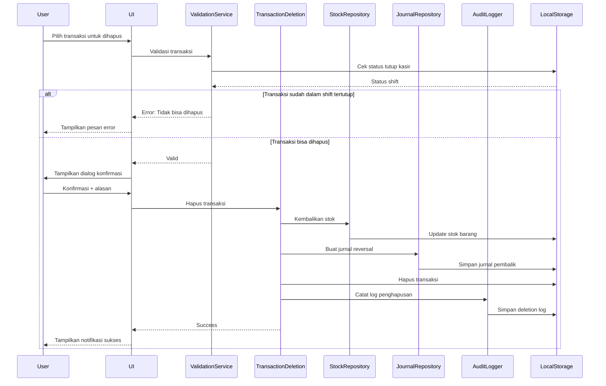

# Design Document

## Overview

Fitur hapus transaksi POS dirancang untuk memberikan kemampuan kepada admin dan kasir untuk menghapus transaksi penjualan yang salah atau perlu dibatalkan. Sistem akan memastikan integritas data dengan melakukan reversal jurnal akuntansi, mengembalikan stok barang, dan mencatat log audit untuk setiap penghapusan.

Fitur ini akan diimplementasikan sebagai halaman baru dalam aplikasi dengan UI yang user-friendly, dilengkapi dengan filter, pencarian, dan konfirmasi yang jelas sebelum melakukan penghapusan.

## Architecture

### High-Level Architecture

```
┌─────────────────────────────────────────────────────────────┐
│                     User Interface Layer                     │
│  ┌──────────────┐  ┌──────────────┐  ┌──────────────────┐  │
│  │ Daftar       │  │ Filter &     │  │ Dialog           │  │
│  │ Transaksi    │  │ Pencarian    │  │ Konfirmasi       │  │
│  └──────────────┘  └──────────────┘  └──────────────────┘  │
└─────────────────────────────────────────────────────────────┘
                            │
                            ▼
┌─────────────────────────────────────────────────────────────┐
│                   Business Logic Layer                       │
│  ┌──────────────┐  ┌──────────────┐  ┌──────────────────┐  │
│  │ Validation   │  │ Transaction  │  │ Audit Logger     │  │
│  │ Service      │  │ Deletion     │  │                  │  │
│  └──────────────┘  └──────────────┘  └──────────────────┘  │
└─────────────────────────────────────────────────────────────┘
                            │
                            ▼
┌─────────────────────────────────────────────────────────────┐
│                      Data Access Layer                       │
│  ┌──────────────┐  ┌──────────────┐  ┌──────────────────┐  │
│  │ Transaction  │  │ Stock        │  │ Journal          │  │
│  │ Repository   │  │ Repository   │  │ Repository       │  │
│  └──────────────┘  └──────────────┘  └──────────────────┘  │
└─────────────────────────────────────────────────────────────┘
                            │
                            ▼
┌─────────────────────────────────────────────────────────────┐
│                    LocalStorage (Data Store)                 │
│  • penjualan  • barang  • jurnal  • deletionLog             │
│  • riwayatTutupKas                                          │
└─────────────────────────────────────────────────────────────┘
```

### Component Interaction Flow



## Components and Interfaces

### 1. UI Components

#### HapusTransaksiPage
Komponen utama yang menampilkan halaman hapus transaksi.

```javascript
function renderHapusTransaksi() {
    // Render halaman dengan:
    // - Header dan judul
    // - Filter dan pencarian
    // - Tabel daftar transaksi
    // - Pagination (jika diperlukan)
}
```

#### TransactionTable
Menampilkan daftar transaksi dalam bentuk tabel.

```javascript
function renderTransactionTable(transactions, filters) {
    // Render tabel dengan kolom:
    // - No Transaksi
    // - Tanggal
    // - Kasir
    // - Anggota/Umum
    // - Total
    // - Metode (Cash/Kredit)
    // - Status
    // - Aksi (tombol hapus)
}
```

#### FilterPanel
Panel untuk filter dan pencarian transaksi.

```javascript
function renderFilterPanel() {
    // Render filter:
    // - Pencarian (no transaksi, kasir)
    // - Filter metode pembayaran
    // - Filter rentang tanggal
    // - Tombol reset filter
}
```

#### ConfirmationDialog
Dialog konfirmasi sebelum menghapus transaksi.

```javascript
function showDeleteConfirmation(transaction) {
    // Tampilkan modal dengan:
    // - Detail transaksi lengkap
    // - Input alasan penghapusan (required)
    // - Tombol konfirmasi dan batal
}
```

### 2. Business Logic Services

#### ValidationService
Melakukan validasi sebelum penghapusan transaksi.

```javascript
class ValidationService {
    /**
     * Validasi apakah transaksi bisa dihapus
     * @param {string} transactionId - ID transaksi
     * @returns {Object} { valid: boolean, message: string }
     */
    validateDeletion(transactionId) {
        // 1. Cek apakah transaksi ada
        // 2. Cek apakah sudah masuk shift tertutup
        // 3. Return hasil validasi
    }
    
    /**
     * Validasi alasan penghapusan
     * @param {string} reason - Alasan penghapusan
     * @returns {Object} { valid: boolean, message: string }
     */
    validateReason(reason) {
        // 1. Cek tidak kosong
        // 2. Cek panjang maksimal 500 karakter
        // 3. Return hasil validasi
    }
}
```

#### TransactionDeletionService
Service utama untuk menghapus transaksi.

```javascript
class TransactionDeletionService {
    /**
     * Hapus transaksi dan lakukan semua operasi terkait
     * @param {string} transactionId - ID transaksi
     * @param {string} reason - Alasan penghapusan
     * @param {string} deletedBy - User yang menghapus
     * @returns {Object} { success: boolean, message: string }
     */
    deleteTransaction(transactionId, reason, deletedBy) {
        // 1. Validasi transaksi
        // 2. Ambil data transaksi lengkap
        // 3. Kembalikan stok barang
        // 4. Buat jurnal reversal
        // 5. Hapus transaksi dari localStorage
        // 6. Catat log audit
        // 7. Return hasil
    }
}
```

#### StockRestorationService
Service untuk mengembalikan stok barang.

```javascript
class StockRestorationService {
    /**
     * Kembalikan stok barang dari transaksi yang dihapus
     * @param {Array} items - Array item transaksi
     * @returns {Object} { success: boolean, warnings: Array }
     */
    restoreStock(items) {
        // 1. Loop setiap item
        // 2. Cari barang di master
        // 3. Tambahkan qty ke stok
        // 4. Catat warning jika barang tidak ditemukan
        // 5. Simpan perubahan
        // 6. Return hasil
    }
}
```

#### JournalReversalService
Service untuk membuat jurnal pembalik.

```javascript
class JournalReversalService {
    /**
     * Buat jurnal pembalik untuk transaksi yang dihapus
     * @param {Object} transaction - Data transaksi
     * @returns {Object} { success: boolean, journalIds: Array }
     */
    createReversalJournals(transaction) {
        // 1. Hitung total dan HPP
        // 2. Buat jurnal pembalik pendapatan
        //    - Debit: Pendapatan Penjualan
        //    - Kredit: Kas/Piutang
        // 3. Buat jurnal pembalik HPP
        //    - Debit: Persediaan Barang
        //    - Kredit: Beban HPP
        // 4. Simpan jurnal dengan tanggal penghapusan
        // 5. Return hasil
    }
}
```

#### AuditLoggerService
Service untuk mencatat log audit penghapusan.

```javascript
class AuditLoggerService {
    /**
     * Catat log penghapusan transaksi
     * @param {Object} transaction - Data transaksi yang dihapus
     * @param {string} reason - Alasan penghapusan
     * @param {string} deletedBy - User yang menghapus
     * @returns {Object} { success: boolean, logId: string }
     */
    logDeletion(transaction, reason, deletedBy) {
        // 1. Buat record log dengan:
        //    - ID log
        //    - Data transaksi lengkap
        //    - Alasan penghapusan
        //    - User yang menghapus
        //    - Timestamp penghapusan
        // 2. Simpan ke localStorage (deletionLog)
        // 3. Return hasil
    }
    
    /**
     * Ambil riwayat penghapusan
     * @returns {Array} Array of deletion logs
     */
    getDeletionHistory() {
        // Return semua log penghapusan
    }
}
```

### 3. Data Access Layer

#### TransactionRepository
Repository untuk operasi data transaksi.

```javascript
class TransactionRepository {
    /**
     * Ambil semua transaksi
     * @returns {Array} Array of transactions
     */
    getAll() {
        return JSON.parse(localStorage.getItem('penjualan') || '[]');
    }
    
    /**
     * Ambil transaksi berdasarkan ID
     * @param {string} id - Transaction ID
     * @returns {Object|null} Transaction object or null
     */
    getById(id) {
        const transactions = this.getAll();
        return transactions.find(t => t.id === id || t.noTransaksi === id);
    }
    
    /**
     * Hapus transaksi
     * @param {string} id - Transaction ID
     * @returns {boolean} Success status
     */
    delete(id) {
        let transactions = this.getAll();
        const initialLength = transactions.length;
        transactions = transactions.filter(t => t.id !== id && t.noTransaksi !== id);
        localStorage.setItem('penjualan', JSON.stringify(transactions));
        return transactions.length < initialLength;
    }
    
    /**
     * Filter transaksi
     * @param {Object} filters - Filter criteria
     * @returns {Array} Filtered transactions
     */
    filter(filters) {
        let transactions = this.getAll();
        
        // Filter by search query
        if (filters.search) {
            const query = filters.search.toLowerCase();
            transactions = transactions.filter(t => 
                (t.noTransaksi && t.noTransaksi.toLowerCase().includes(query)) ||
                (t.id && t.id.toLowerCase().includes(query)) ||
                (t.kasir && t.kasir.toLowerCase().includes(query))
            );
        }
        
        // Filter by payment method
        if (filters.metode) {
            transactions = transactions.filter(t => t.metode === filters.metode);
        }
        
        // Filter by date range
        if (filters.startDate) {
            transactions = transactions.filter(t => 
                new Date(t.tanggal) >= new Date(filters.startDate)
            );
        }
        if (filters.endDate) {
            const endDate = new Date(filters.endDate);
            endDate.setHours(23, 59, 59, 999);
            transactions = transactions.filter(t => 
                new Date(t.tanggal) <= endDate
            );
        }
        
        return transactions;
    }
}
```

#### StockRepository
Repository untuk operasi data stok barang.

```javascript
class StockRepository {
    /**
     * Ambil semua barang
     * @returns {Array} Array of items
     */
    getAll() {
        return JSON.parse(localStorage.getItem('barang') || '[]');
    }
    
    /**
     * Update stok barang
     * @param {string} itemId - Item ID
     * @param {number} quantity - Quantity to add
     * @returns {boolean} Success status
     */
    addStock(itemId, quantity) {
        const items = this.getAll();
        const item = items.find(i => i.id === itemId);
        
        if (item) {
            item.stok += quantity;
            localStorage.setItem('barang', JSON.stringify(items));
            return true;
        }
        
        return false;
    }
}
```

#### JournalRepository
Repository untuk operasi data jurnal.

```javascript
class JournalRepository {
    /**
     * Tambah jurnal baru
     * @param {Object} journal - Journal data
     * @returns {string} Journal ID
     */
    add(journal) {
        const journals = JSON.parse(localStorage.getItem('jurnal') || '[]');
        const journalData = {
            id: generateId(),
            tanggal: journal.tanggal || new Date().toISOString(),
            keterangan: journal.keterangan,
            entries: journal.entries
        };
        
        journals.push(journalData);
        localStorage.setItem('jurnal', JSON.stringify(journals));
        
        // Update COA saldo
        this.updateCOASaldo(journal.entries);
        
        return journalData.id;
    }
    
    /**
     * Update saldo COA
     * @param {Array} entries - Journal entries
     */
    updateCOASaldo(entries) {
        const coa = JSON.parse(localStorage.getItem('coa') || '[]');
        
        entries.forEach(entry => {
            const akun = coa.find(c => c.kode === entry.akun);
            if (akun) {
                if (akun.tipe === 'Aset' || akun.tipe === 'Beban') {
                    akun.saldo += entry.debit - entry.kredit;
                } else {
                    akun.saldo += entry.kredit - entry.debit;
                }
            }
        });
        
        localStorage.setItem('coa', JSON.stringify(coa));
    }
}
```

#### DeletionLogRepository
Repository untuk operasi data log penghapusan.

```javascript
class DeletionLogRepository {
    /**
     * Simpan log penghapusan
     * @param {Object} log - Deletion log data
     * @returns {string} Log ID
     */
    save(log) {
        const logs = JSON.parse(localStorage.getItem('deletionLog') || '[]');
        const logData = {
            id: generateId(),
            ...log,
            deletedAt: new Date().toISOString()
        };
        
        logs.push(logData);
        localStorage.setItem('deletionLog', JSON.stringify(logs));
        
        return logData.id;
    }
    
    /**
     * Ambil semua log penghapusan
     * @returns {Array} Array of deletion logs
     */
    getAll() {
        return JSON.parse(localStorage.getItem('deletionLog') || '[]');
    }
    
    /**
     * Ambil log berdasarkan ID transaksi
     * @param {string} transactionId - Transaction ID
     * @returns {Object|null} Deletion log or null
     */
    getByTransactionId(transactionId) {
        const logs = this.getAll();
        return logs.find(l => l.transactionId === transactionId);
    }
}
```

## Data Models

### Transaction Model
```javascript
{
    id: string,                    // Unique ID (legacy)
    noTransaksi: string,           // Readable transaction number (TRX-YYMMDD-NNNN)
    tanggal: string (ISO),         // Transaction date
    kasir: string,                 // Cashier name
    anggotaId: string | null,      // Member ID (null for general customer)
    tipeAnggota: string,           // Member type (Anggota/Umum)
    metode: string,                // Payment method (cash/bon)
    items: [                       // Transaction items
        {
            id: string,            // Item ID
            nama: string,          // Item name
            harga: number,         // Selling price
            hpp: number,           // Cost of goods sold
            qty: number,           // Quantity
            stok: number           // Available stock at transaction time
        }
    ],
    total: number,                 // Total amount
    uangBayar: number,             // Payment amount (for cash)
    kembalian: number,             // Change (for cash)
    status: string                 // Transaction status (lunas/kredit)
}
```

### Deletion Log Model
```javascript
{
    id: string,                    // Log ID
    transactionId: string,         // Original transaction ID
    transactionNo: string,         // Original transaction number
    transactionData: Object,       // Complete transaction data before deletion
    reason: string,                // Deletion reason
    deletedBy: string,             // User who deleted
    deletedAt: string (ISO),       // Deletion timestamp
    stockRestored: boolean,        // Stock restoration status
    journalReversed: boolean,      // Journal reversal status
    warnings: Array<string>        // Any warnings during deletion
}
```

### Journal Entry Model
```javascript
{
    id: string,                    // Journal ID
    tanggal: string (ISO),         // Journal date
    keterangan: string,            // Description
    entries: [                     // Journal entries
        {
            akun: string,          // Account code
            debit: number,         // Debit amount
            kredit: number         // Credit amount
        }
    ]
}
```

### Filter Model
```javascript
{
    search: string,                // Search query (transaction no, cashier)
    metode: string,                // Payment method filter (cash/bon/all)
    startDate: string,             // Start date filter
    endDate: string                // End date filter
}
```

## Correctness Properties

*A property is a characteristic or behavior that should hold true across all valid executions of a system-essentially, a formal statement about what the system should do. Properties serve as the bridge between human-readable specifications and machine-verifiable correctness guarantees.*


### Property 1: Search filtering correctness
*For any* search query and transaction list, all returned transactions should have either the transaction number or cashier name containing the search query (case-insensitive).
**Validates: Requirements 1.2**

### Property 2: Payment method filtering correctness
*For any* payment method filter (cash/bon) and transaction list, all returned transactions should have the specified payment method.
**Validates: Requirements 1.3**

### Property 3: Date range filtering correctness
*For any* date range (start date and end date) and transaction list, all returned transactions should have transaction dates within the specified range (inclusive).
**Validates: Requirements 1.4**

### Property 4: Confirmation dialog completeness
*For any* transaction selected for deletion, the confirmation dialog should display all required transaction details (transaction number, date, cashier, items, total, payment method).
**Validates: Requirements 2.1**

### Property 5: Transaction deletion removes from storage
*For any* transaction, when deletion is confirmed with a valid reason, the transaction should no longer exist in localStorage after the operation completes.
**Validates: Requirements 2.2**

### Property 6: Successful deletion shows notification
*For any* transaction successfully deleted, a success notification should be displayed to the user.
**Validates: Requirements 2.3**

### Property 7: Cancellation preserves data
*For any* transaction, when deletion is canceled, the transaction data in localStorage should remain unchanged (invariant).
**Validates: Requirements 2.4**

### Property 8: Error handling displays message
*For any* error condition during deletion, an error message should be displayed to the user.
**Validates: Requirements 2.5**

### Property 9: Stock restoration for all items
*For any* transaction with items, when the transaction is deleted, the stock for each item should be restored by adding back the quantity sold.
**Validates: Requirements 3.1, 3.2**

### Property 10: Cash transaction journal reversal
*For any* cash transaction, when deleted, a reversal journal should be created with debit to "Pendapatan Penjualan" (4-1000) and credit to "Kas" (1-1000) for the transaction total.
**Validates: Requirements 4.1**

### Property 11: Credit transaction journal reversal
*For any* credit transaction, when deleted, a reversal journal should be created with debit to "Pendapatan Penjualan" (4-1000) and credit to "Piutang Anggota" (1-1200) for the transaction total.
**Validates: Requirements 4.2**

### Property 12: HPP journal reversal
*For any* transaction, when deleted, an HPP reversal journal should be created with debit to "Persediaan Barang" (1-1300) and credit to "Harga Pokok Penjualan" (5-1000) for the total HPP amount.
**Validates: Requirements 4.3**

### Property 13: Reversal journal description format
*For any* reversal journal created during deletion, the description should clearly mention "Hapus Transaksi" or "Reversal" and include the original transaction number.
**Validates: Requirements 4.4**

### Property 14: Reversal journal date
*For any* reversal journal created during deletion, the journal date should be the deletion date (current date), not the original transaction date.
**Validates: Requirements 4.5**

### Property 15: Deletion log creation
*For any* transaction deleted, a deletion log entry should be created containing the transaction ID, transaction number, complete transaction data, deletion reason, user who deleted, and deletion timestamp.
**Validates: Requirements 5.1**

### Property 16: Deletion history display format
*For any* deletion log displayed in the history, it should show transaction number, transaction date, deletion date, user who deleted, and deletion reason.
**Validates: Requirements 5.4**

### Property 17: Deletion detail completeness
*For any* deletion log viewed in detail, it should display the complete original transaction data that was deleted.
**Validates: Requirements 5.5**

### Property 18: Reason input requirement
*For any* deletion confirmation, the system should require a non-empty reason before allowing the deletion to proceed.
**Validates: Requirements 6.1**

### Property 19: Reason storage in log
*For any* deletion with a valid reason, the reason should be stored in the deletion log entry.
**Validates: Requirements 6.3**

### Property 20: Closed shift validation
*For any* transaction, before allowing deletion, the system should check if the transaction belongs to a closed shift (tutup kasir), and if so, prevent the deletion.
**Validates: Requirements 7.1**

## Error Handling

### Validation Errors

1. **Empty Reason Error**
   - Condition: User attempts to delete without providing a reason
   - Response: Display warning message "Alasan penghapusan harus diisi"
   - Action: Prevent deletion, keep dialog open

2. **Reason Too Long Error**
   - Condition: Reason exceeds 500 characters
   - Response: Display warning message "Alasan maksimal 500 karakter"
   - Action: Prevent deletion, highlight character count

3. **Closed Shift Error**
   - Condition: Transaction belongs to a closed shift
   - Response: Display error message "Transaksi sudah masuk dalam laporan tutup kasir yang sudah ditutup dan tidak dapat dihapus"
   - Action: Prevent deletion, close dialog

4. **Transaction Not Found Error**
   - Condition: Transaction ID doesn't exist in storage
   - Response: Display error message "Transaksi tidak ditemukan"
   - Action: Refresh transaction list

### System Errors

1. **Storage Error**
   - Condition: localStorage operation fails
   - Response: Display error message "Gagal menyimpan data. Silakan coba lagi"
   - Action: Rollback any partial changes, log error

2. **Stock Restoration Warning**
   - Condition: Item in transaction not found in master data
   - Response: Log warning "Barang [nama] tidak ditemukan, stok tidak dapat dikembalikan"
   - Action: Continue with deletion, record warning in log

3. **Journal Creation Error**
   - Condition: Failed to create reversal journal
   - Response: Display error message "Gagal membuat jurnal pembalik"
   - Action: Rollback transaction deletion, log error

### Error Recovery

All critical operations (stock restoration, journal reversal, transaction deletion) should be performed in a transactional manner:

1. Validate all preconditions
2. Perform all operations
3. If any operation fails, rollback all changes
4. Log the error for debugging
5. Display user-friendly error message

## Testing Strategy

### Unit Testing

Unit tests will verify individual functions and components work correctly:

1. **Validation Functions**
   - Test `validateDeletion()` with various transaction states
   - Test `validateReason()` with empty, valid, and too-long reasons
   - Test closed shift detection logic

2. **Repository Functions**
   - Test `TransactionRepository.filter()` with various filter combinations
   - Test `StockRepository.addStock()` with valid and invalid item IDs
   - Test `JournalRepository.add()` and COA saldo updates
   - Test `DeletionLogRepository.save()` and retrieval

3. **Service Functions**
   - Test `StockRestorationService.restoreStock()` with various item scenarios
   - Test `JournalReversalService.createReversalJournals()` for cash and credit transactions
   - Test `AuditLoggerService.logDeletion()` with complete transaction data

4. **UI Components**
   - Test filter panel updates transaction list correctly
   - Test confirmation dialog displays all transaction details
   - Test success/error notifications appear correctly

### Property-Based Testing

Property-based tests will verify universal properties hold across all inputs using **fast-check** library for JavaScript. Each test will run a minimum of 100 iterations with randomly generated data.

1. **Search and Filter Properties**
   - Generate random transaction lists and search queries
   - Verify Property 1: Search filtering correctness
   - Verify Property 2: Payment method filtering correctness
   - Verify Property 3: Date range filtering correctness

2. **Deletion Properties**
   - Generate random transactions with various states
   - Verify Property 5: Transaction deletion removes from storage
   - Verify Property 7: Cancellation preserves data (invariant)
   - Verify Property 9: Stock restoration for all items

3. **Journal Reversal Properties**
   - Generate random cash and credit transactions
   - Verify Property 10: Cash transaction journal reversal
   - Verify Property 11: Credit transaction journal reversal
   - Verify Property 12: HPP journal reversal
   - Verify Property 13: Reversal journal description format
   - Verify Property 14: Reversal journal date

4. **Audit Log Properties**
   - Generate random deletions with various reasons
   - Verify Property 15: Deletion log creation
   - Verify Property 19: Reason storage in log

5. **Validation Properties**
   - Generate random transactions and shift states
   - Verify Property 20: Closed shift validation

### Integration Testing

Integration tests will verify the complete deletion flow works end-to-end:

1. **Complete Deletion Flow**
   - Create a transaction with items
   - Delete the transaction with a valid reason
   - Verify transaction is removed from storage
   - Verify stock is restored for all items
   - Verify reversal journals are created correctly
   - Verify deletion log is created with all details

2. **Closed Shift Prevention**
   - Create a transaction in a shift
   - Close the shift (tutup kasir)
   - Attempt to delete the transaction
   - Verify deletion is prevented with appropriate error message

3. **Error Scenarios**
   - Test deletion with missing items (stock restoration warning)
   - Test deletion with invalid transaction ID
   - Test deletion without reason (validation error)

### Test Data Generators

For property-based testing, we'll create generators for:

1. **Transaction Generator**
   ```javascript
   fc.record({
       id: fc.string(),
       noTransaksi: fc.string(),
       tanggal: fc.date(),
       kasir: fc.string(),
       metode: fc.constantFrom('cash', 'bon'),
       items: fc.array(itemGenerator),
       total: fc.nat(),
       status: fc.constantFrom('lunas', 'kredit')
   })
   ```

2. **Item Generator**
   ```javascript
   fc.record({
       id: fc.string(),
       nama: fc.string(),
       harga: fc.nat(),
       hpp: fc.nat(),
       qty: fc.integer({ min: 1, max: 100 })
   })
   ```

3. **Filter Generator**
   ```javascript
   fc.record({
       search: fc.option(fc.string()),
       metode: fc.option(fc.constantFrom('cash', 'bon')),
       startDate: fc.option(fc.date()),
       endDate: fc.option(fc.date())
   })
   ```

## Security Considerations

1. **Authorization**
   - Only users with 'administrator' or 'kasir' roles can access deletion feature
   - Check user role before rendering deletion UI
   - Validate user role on every deletion operation

2. **Audit Trail**
   - All deletions are logged with user information
   - Deletion logs are immutable (cannot be deleted or modified)
   - Logs include complete transaction data for forensic analysis

3. **Data Integrity**
   - Validate transaction exists before deletion
   - Prevent deletion of transactions in closed shifts
   - Ensure all related data (stock, journals) are updated atomically

4. **Input Validation**
   - Sanitize deletion reason input
   - Validate transaction ID format
   - Prevent SQL injection (not applicable for localStorage, but good practice)

## Performance Considerations

1. **Transaction List Loading**
   - Load transactions lazily if list is very large (>1000 items)
   - Implement pagination for better performance
   - Cache filtered results to avoid re-filtering on every render

2. **Filter Operations**
   - Use efficient array filtering methods
   - Debounce search input to avoid excessive filtering
   - Index transactions by date for faster date range queries

3. **Storage Operations**
   - Batch localStorage writes when possible
   - Use try-catch for all localStorage operations
   - Consider localStorage size limits (typically 5-10MB)

4. **UI Responsiveness**
   - Show loading indicator during deletion operation
   - Use async operations to prevent UI blocking
   - Provide immediate feedback for user actions

## Implementation Notes

1. **Backward Compatibility**
   - Support both `id` and `noTransaksi` for transaction identification
   - Handle transactions that may not have `noTransaksi` field (legacy data)

2. **Deletion Reason**
   - Make reason field required with clear validation
   - Provide common reason templates (e.g., "Kesalahan input", "Transaksi dibatalkan")
   - Store reason in deletion log for audit purposes

3. **Stock Restoration**
   - Handle missing items gracefully with warnings
   - Log all stock restoration operations
   - Verify stock doesn't go negative after restoration

4. **Journal Reversal**
   - Use current date for reversal journals, not original transaction date
   - Include clear description with transaction number
   - Ensure COA saldo is updated correctly

5. **UI/UX**
   - Use color coding for transaction status (lunas=green, kredit=orange)
   - Show confirmation dialog with all transaction details
   - Provide clear success/error messages
   - Allow users to view deletion history

## Future Enhancements

1. **Soft Delete**
   - Instead of hard delete, mark transactions as deleted
   - Allow restoration of deleted transactions within a time window
   - Implement permanent deletion after retention period

2. **Batch Deletion**
   - Allow selection of multiple transactions for deletion
   - Provide bulk deletion with single reason
   - Show progress indicator for batch operations

3. **Advanced Filters**
   - Filter by transaction amount range
   - Filter by member/customer
   - Filter by transaction status

4. **Export Deletion History**
   - Export deletion logs to CSV/Excel
   - Generate deletion audit reports
   - Schedule periodic deletion reports

5. **Approval Workflow**
   - Require manager approval for deletions above certain amount
   - Implement multi-level approval for sensitive deletions
   - Send notifications for deletion requests
