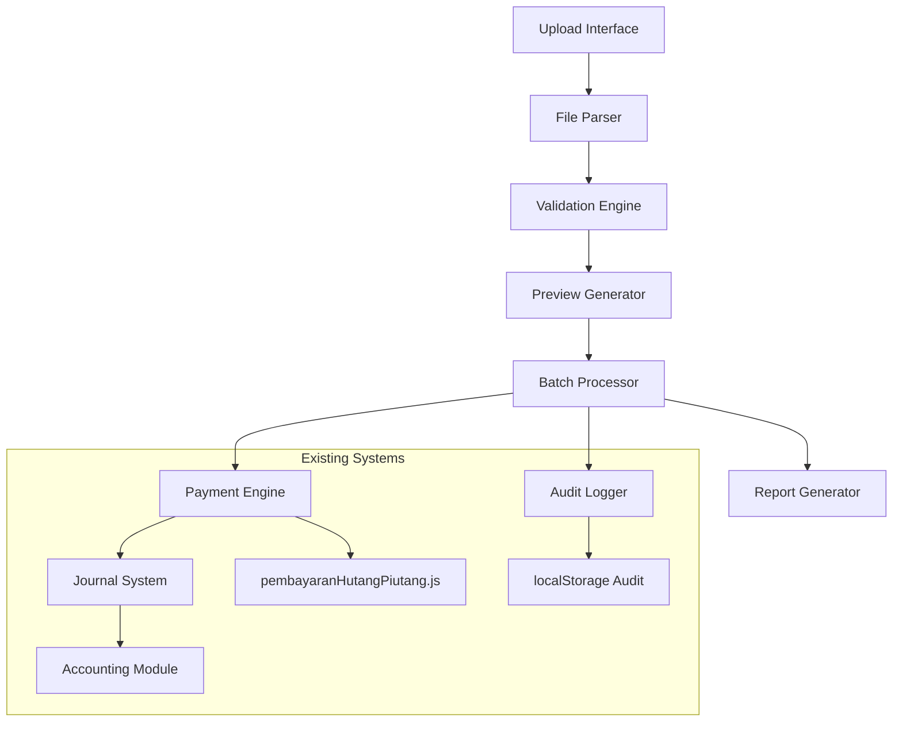

# Design Document - Import Tagihan Pembayaran Hutang Piutang

## Overview

Fitur import tagihan pembayaran hutang piutang adalah extension dari sistem pembayaran hutang piutang yang sudah ada. Fitur ini memungkinkan pemrosesan batch pembayaran melalui file CSV/Excel, dengan fokus pada validasi data yang ketat, preview sebelum eksekusi, dan error handling yang robust. Sistem akan terintegrasi dengan modul akuntansi existing untuk memastikan konsistensi jurnal dan saldo.

## Architecture

### High-Level Architecture



### Component Integration

Fitur ini akan mengintegrasikan dengan sistem existing:
- **pembayaranHutangPiutang.js**: Untuk logic pembayaran individual
- **Accounting Module**: Untuk pencatatan jurnal
- **Member Management**: Untuk validasi anggota
- **Audit System**: Untuk tracking dan logging

## Components and Interfaces

### 1. ImportTagihanManager
**Responsibility**: Orchestrator utama untuk proses import
```javascript
class ImportTagihanManager {
    constructor(paymentEngine, auditLogger)
    async uploadFile(file)
    async validateData(rawData)
    async generatePreview(validatedData)
    async processBatch(confirmedData)
    async generateReport(results)
}
```

### 2. FileParser
**Responsibility**: Parsing file CSV/Excel menjadi data terstruktur
```javascript
class FileParser {
    async parseCSV(file)
    async parseExcel(file)
    validateFileFormat(file)
    validateFileSize(file)
}
```

### 3. ValidationEngine
**Responsibility**: Validasi data import sebelum pemrosesan
```javascript
class ValidationEngine {
    async validateRow(rowData)
    async validateMember(memberNumber)
    async validatePaymentType(type)
    async validateAmount(amount, memberBalance)
    generateValidationReport(results)
}
```

### 4. BatchProcessor
**Responsibility**: Pemrosesan transaksi secara batch
```javascript
class BatchProcessor {
    constructor(paymentEngine, auditLogger)
    async processPayments(validatedData)
    async rollbackBatch(batchId)
    trackProgress(callback)
    handleCancellation()
}
```

### 5. PreviewGenerator
**Responsibility**: Generate preview data untuk konfirmasi user
```javascript
class PreviewGenerator {
    generatePreviewTable(validatedData)
    calculateSummary(data)
    highlightErrors(data)
    formatCurrency(amount)
}
```

## Data Models

### ImportBatch
```javascript
{
    id: string,
    fileName: string,
    uploadedBy: string,
    uploadedAt: Date,
    totalRows: number,
    validRows: number,
    invalidRows: number,
    status: 'uploaded' | 'validated' | 'processing' | 'completed' | 'cancelled',
    processedAt: Date,
    results: ImportResult[]
}
```

### ImportRow
```javascript
{
    rowNumber: number,
    memberNumber: string,
    memberName: string,
    paymentType: 'hutang' | 'piutang',
    amount: number,
    description: string,
    isValid: boolean,
    validationErrors: string[],
    transactionId: string | null,
    processedAt: Date | null
}
```

### ImportResult
```javascript
{
    batchId: string,
    totalProcessed: number,
    successCount: number,
    failureCount: number,
    successTransactions: Transaction[],
    failedTransactions: FailedTransaction[],
    summary: {
        totalAmount: number,
        totalHutang: number,
        totalPiutang: number
    }
}
```

### Template Structure
```csv
nomor_anggota,nama_anggota,jenis_pembayaran,jumlah_pembayaran,keterangan
001,John Doe,hutang,500000,Cicilan bulan Januari
002,Jane Smith,piutang,300000,Pengembalian simpanan
```

## Correctness Properties

*A property is a characteristic or behavior that should hold true across all valid executions of a system-essentially, a formal statement about what the system should do. Properties serve as the bridge between human-readable specifications and machine-verifiable correctness guarantees.*

### Property Reflection

After reviewing all properties identified in the prework, I identified several areas for consolidation:

- Properties 2.1, 2.2, 2.3 can be combined into a comprehensive file validation property
- Properties 3.1, 3.2, 3.3, 3.4 can be combined into a comprehensive data validation property  
- Properties 4.1, 4.2, 4.3 can be combined into a comprehensive preview generation property
- Properties 5.2 and 5.3 can be combined into a comprehensive transaction processing property
- Properties 7.1 and 7.2 can be combined into a comprehensive audit logging property
- Properties 8.4 and 10.3 are essentially the same rollback functionality

This consolidation eliminates redundancy while maintaining comprehensive coverage of all requirements.

### Correctness Properties

Property 1: Template download consistency
*For any* template download request, the generated file should contain the required columns (nomor_anggota, nama_anggota, jenis_pembayaran, jumlah_pembayaran, keterangan), example data, and a unique timestamped filename
**Validates: Requirements 1.2, 1.3**

Property 2: File upload validation completeness  
*For any* uploaded file, the system should validate file format (CSV/Excel only), column structure matching template, and file size within limits, rejecting invalid files with specific error messages
**Validates: Requirements 2.1, 2.2, 2.4**

Property 3: Data validation accuracy
*For any* import data row, the system should validate member existence, payment type (hutang/piutang only), positive amount values, and amount not exceeding member balance, marking invalid rows appropriately
**Validates: Requirements 3.1, 3.2, 3.3, 3.4**

Property 4: Preview generation completeness
*For any* validated import data, the preview should display all rows with validation status, accurate summary calculations, and error details for invalid rows
**Validates: Requirements 4.1, 4.2, 4.3**

Property 5: Batch processing selectivity
*For any* batch processing request, only valid rows should be processed while invalid rows are skipped, maintaining data integrity
**Validates: Requirements 5.1**

Property 6: Transaction processing consistency
*For any* processed payment in a batch, the system should create corresponding journal entries and update member balances atomically
**Validates: Requirements 5.2, 5.3**

Property 7: Report generation accuracy
*For any* completed batch, the generated report should accurately count successful and failed transactions, include transaction IDs for successful payments, and provide detailed failure reasons
**Validates: Requirements 6.1, 6.2**

Property 8: Audit logging completeness
*For any* import operation (upload, validation, processing), the system should create comprehensive audit logs with timestamps, user information, and operation details
**Validates: Requirements 7.1, 7.2**

Property 9: Error handling graceful degradation
*For any* system error during import processing, the system should display clear error messages, prevent data corruption, and maintain system stability
**Validates: Requirements 8.1**

Property 10: Rollback consistency
*For any* critical error or cancellation during batch processing, the system should rollback all transactions processed in that batch, restoring member balances to pre-batch state
**Validates: Requirements 8.4, 10.3**

Property 11: Cancellation responsiveness
*For any* cancellation request during batch processing, the system should stop processing new transactions and initiate rollback procedures
**Validates: Requirements 10.2**

## Error Handling

### Error Categories

1. **File Upload Errors**
   - Invalid file format
   - File size exceeded
   - Corrupted file
   - Missing required columns

2. **Data Validation Errors**
   - Invalid member number
   - Invalid payment type
   - Invalid amount format
   - Amount exceeds balance

3. **Processing Errors**
   - Database connection failure
   - Journal entry failure
   - Balance update failure
   - System resource exhaustion

4. **System Errors**
   - Memory overflow
   - Network timeout
   - Storage failure
   - Authentication failure

### Error Handling Strategy

- **Graceful Degradation**: System continues operating even when non-critical errors occur
- **Atomic Operations**: Each transaction is processed atomically to prevent partial updates
- **Rollback Capability**: Ability to undo batch operations when critical errors occur
- **Error Logging**: Comprehensive logging for troubleshooting and audit purposes
- **User Feedback**: Clear, actionable error messages for users

## Testing Strategy

### Unit Testing
- File parsing functions with various file formats and structures
- Validation engine with edge cases and boundary conditions
- Batch processor with different data scenarios
- Error handling with simulated failure conditions

### Property-Based Testing
The system will use **fast-check** library for JavaScript property-based testing. Each property-based test will run a minimum of 100 iterations to ensure comprehensive coverage.

Property-based tests will be implemented for:
- File validation across random file types and sizes
- Data validation across random member data and amounts
- Batch processing with random valid/invalid data combinations
- Rollback functionality with random failure scenarios
- Audit logging across random operation sequences

Each property-based test will be tagged with comments explicitly referencing the correctness property from this design document using the format: **Feature: import-tagihan-pembayaran, Property {number}: {property_text}**

### Integration Testing
- End-to-end import workflow testing
- Integration with existing payment system
- Integration with accounting module
- Database transaction consistency testing

### Performance Testing
- Large file processing (up to 5MB)
- Batch processing with maximum allowed rows
- Memory usage during processing
- Response time for preview generation

### Security Testing
- File upload security (malicious files)
- Input validation bypass attempts
- Authentication and authorization
- Audit trail integrity