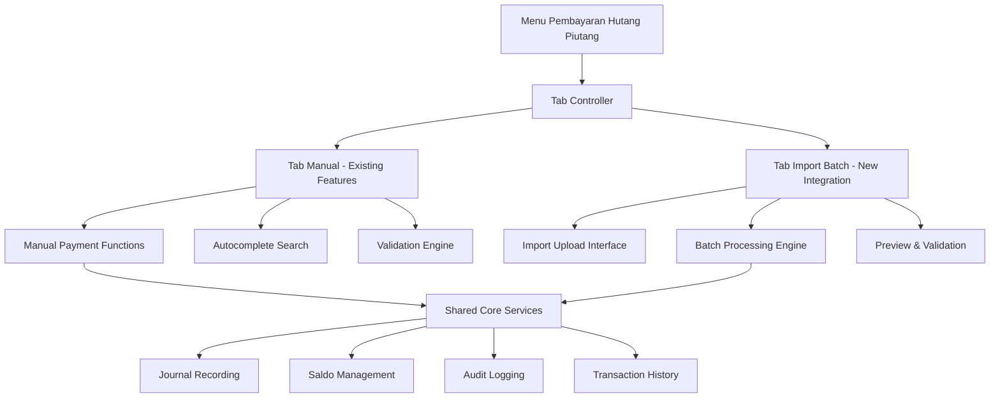

# Design Document - Integrasi Import ke Menu Pembayaran Hutang Piutang

## Overview

Desain ini mengintegrasikan fitur import tagihan pembayaran ke dalam menu Pembayaran Hutang Piutang yang sudah ada, menciptakan interface unified dengan tab-based navigation. Integrasi ini memungkinkan kasir untuk memilih antara pembayaran manual (satuan) atau import batch (massal) dalam satu menu yang kohesif.

## Architecture

### High-Level Architecture



### Integration Strategy

1. **Wrapper Component**: Membuat wrapper component yang menggabungkan kedua fitur
2. **Shared Services**: Menggunakan service layer yang sama untuk jurnal, saldo, dan audit
3. **Unified Data Model**: Menggunakan struktur data yang konsisten untuk kedua mode
4. **Common UI Components**: Menggunakan komponen UI yang sama untuk konsistensi

## Components and Interfaces

### 1. Main Integration Controller

```javascript
class PembayaranHutangPiutangIntegrated {
    constructor() {
        this.activeTab = 'manual';
        this.manualController = new PembayaranHutangPiutangManual();
        this.importController = new ImportTagihanController();
        this.sharedServices = new SharedPaymentServices();
    }
    
    // Tab management
    switchTab(tabName)
    saveTabState()
    restoreTabState()
    
    // Unified rendering
    render()
    renderTabNavigation()
    renderActiveTabContent()
}
```

### 2. Shared Payment Services

```javascript
class SharedPaymentServices {
    // Jurnal recording (shared between both modes)
    createJurnalEntry(paymentData)
    
    // Saldo management (shared between both modes)
    updateSaldoHutang(anggotaId, amount)
    updateSaldoPiutang(anggotaId, amount)
    
    // Audit logging (enhanced for mode tracking)
    logPaymentTransaction(transactionData, mode)
    
    // Transaction history (unified view)
    getTransactionHistory(filters)
    
    // Validation (shared validation rules)
    validatePaymentAmount(amount, saldo, jenis)
}
```

### 3. Enhanced Manual Payment Controller

```javascript
class PembayaranHutangPiutangManual extends ExistingPembayaranHutangPiutang {
    constructor(sharedServices) {
        super();
        this.sharedServices = sharedServices;
    }
    
    // Override to use shared services
    prosesPembayaran(data) {
        // Use shared validation and processing
        return this.sharedServices.processPayment(data, 'manual');
    }
}
```

### 4. Enhanced Import Controller

```javascript
class ImportTagihanController extends ExistingImportTagihan {
    constructor(sharedServices) {
        super();
        this.sharedServices = sharedServices;
    }
    
    // Override to use shared services
    processBatchPayments(batchData) {
        // Use shared validation and processing
        return this.sharedServices.processBatchPayments(batchData, 'import');
    }
}
```

## Data Models

### Enhanced Transaction Model

```javascript
const TransactionModel = {
    id: 'string',
    anggotaId: 'string',
    anggotaNama: 'string',
    jenisPembayaran: 'hutang|piutang',
    jumlah: 'number',
    tanggal: 'datetime',
    kasir: 'string',
    mode: 'manual|import',  // New field
    batchId: 'string|null', // For import transactions
    keterangan: 'string',
    saldoSebelum: 'number',
    saldoSesudah: 'number',
    jurnalId: 'string',
    status: 'success|failed|pending'
};
```

### Batch Processing Model

```javascript
const BatchModel = {
    id: 'string',
    fileName: 'string',
    uploadTime: 'datetime',
    kasir: 'string',
    totalRows: 'number',
    validRows: 'number',
    processedRows: 'number',
    failedRows: 'number',
    status: 'uploaded|validated|processing|completed|failed',
    transactions: 'TransactionModel[]',
    errors: 'ErrorModel[]'
};
```

## User Interface Design

### Tab Navigation

```html
<div class="pembayaran-container">
    <div class="tab-navigation">
        <button class="tab-btn active" data-tab="manual">
            <i class="fas fa-user"></i> Pembayaran Manual
        </button>
        <button class="tab-btn" data-tab="import">
            <i class="fas fa-upload"></i> Import Batch
        </button>
    </div>
    
    <div class="tab-content">
        <div id="manual-tab" class="tab-pane active">
            <!-- Existing manual payment interface -->
        </div>
        <div id="import-tab" class="tab-pane">
            <!-- Import batch interface -->
        </div>
    </div>
</div>
```

### Unified Transaction History

```html
<div class="transaction-history">
    <div class="filters">
        <select id="mode-filter">
            <option value="">Semua Mode</option>
            <option value="manual">Manual</option>
            <option value="import">Import Batch</option>
        </select>
        <!-- Other existing filters -->
    </div>
    
    <table class="transaction-table">
        <thead>
            <tr>
                <th>Tanggal</th>
                <th>Anggota</th>
                <th>Jenis</th>
                <th>Jumlah</th>
                <th>Mode</th> <!-- New column -->
                <th>Kasir</th>
                <th>Aksi</th>
            </tr>
        </thead>
        <tbody id="transaction-list">
            <!-- Unified transaction rows -->
        </tbody>
    </table>
</div>
```

## Integration Implementation Plan

### Phase 1: Core Integration Setup

1. **Create Integration Wrapper**
   - Buat `js/pembayaranHutangPiutangIntegrated.js`
   - Setup tab navigation dan state management
   - Integrate existing controllers

2. **Enhance Shared Services**
   - Extract common functions ke `SharedPaymentServices`
   - Add mode tracking ke semua operations
   - Ensure data consistency

### Phase 2: UI Integration

1. **Update Main Interface**
   - Modify existing HTML untuk tab structure
   - Integrate import interface ke tab kedua
   - Update navigation dan routing

2. **Enhance Transaction History**
   - Add mode column dan filter
   - Update display logic untuk unified view
   - Enhance export functionality

### Phase 3: Data Migration & Testing

1. **Data Model Updates**
   - Add mode field ke existing transactions
   - Migrate existing data dengan mode 'manual'
   - Update all queries dan filters

2. **Comprehensive Testing**
   - Test tab switching dan state management
   - Test data consistency antara modes
   - Test all existing functionality masih bekerja

## Error Handling

### Tab Switching with Unsaved Data

```javascript
function switchTab(newTab) {
    if (hasUnsavedData()) {
        showConfirmDialog({
            title: 'Data Belum Tersimpan',
            message: 'Anda memiliki data yang belum tersimpan. Simpan sekarang?',
            buttons: [
                { text: 'Simpan & Lanjut', action: () => saveAndSwitch(newTab) },
                { text: 'Buang & Lanjut', action: () => discardAndSwitch(newTab) },
                { text: 'Batal', action: () => {} }
            ]
        });
    } else {
        performTabSwitch(newTab);
    }
}
```

### Cross-Mode Data Consistency

```javascript
function ensureDataConsistency() {
    // Validate saldo consistency
    const manualSaldo = calculateSaldoFromManualTransactions();
    const importSaldo = calculateSaldoFromImportTransactions();
    const totalSaldo = manualSaldo + importSaldo;
    
    if (totalSaldo !== getCurrentSaldoFromDatabase()) {
        throw new Error('Data inconsistency detected between payment modes');
    }
}
```

## Testing Strategy

### Unit Tests

1. **Tab Controller Tests**
   - Test tab switching logic
   - Test state preservation
   - Test unsaved data handling

2. **Shared Services Tests**
   - Test mode-aware operations
   - Test data consistency
   - Test error handling

### Integration Tests

1. **Cross-Mode Integration**
   - Test manual payment followed by import
   - Test import batch followed by manual payment
   - Test unified transaction history

2. **Data Consistency Tests**
   - Test saldo calculations across modes
   - Test journal entries consistency
   - Test audit log completeness

### Property-Based Tests

1. **Mode Switching Properties**
   - For any tab switch with unsaved data, user should be prompted
   - For any completed transaction, it should appear in unified history
   - For any mode, saldo calculations should be consistent

2. **Data Integrity Properties**
   - For any payment (manual or import), journal entries should balance
   - For any transaction, audit log should be complete
   - For any batch import, individual transactions should be traceable

## Performance Considerations

### Lazy Loading

```javascript
// Load import controller only when import tab is accessed
function loadImportTab() {
    if (!this.importController) {
        this.importController = new ImportTagihanController(this.sharedServices);
    }
    return this.importController;
}
```

### Efficient Data Queries

```javascript
// Optimize unified transaction history queries
function getUnifiedTransactionHistory(filters) {
    // Use indexed queries with mode filter
    // Implement pagination for large datasets
    // Cache frequently accessed data
}
```

## Security Considerations

### Role-Based Access Control

```javascript
function checkTabAccess(tabName, userRole) {
    const permissions = {
        manual: ['kasir', 'admin'],
        import: ['admin'] // More restrictive for import
    };
    
    return permissions[tabName].includes(userRole);
}
```

### Audit Trail Enhancement

```javascript
function enhancedAuditLog(action, data, mode) {
    const auditEntry = {
        ...standardAuditFields,
        mode: mode,
        tabContext: getCurrentTab(),
        sessionId: getCurrentSessionId(),
        ipAddress: getUserIP()
    };
    
    saveAuditLog(auditEntry);
}
```