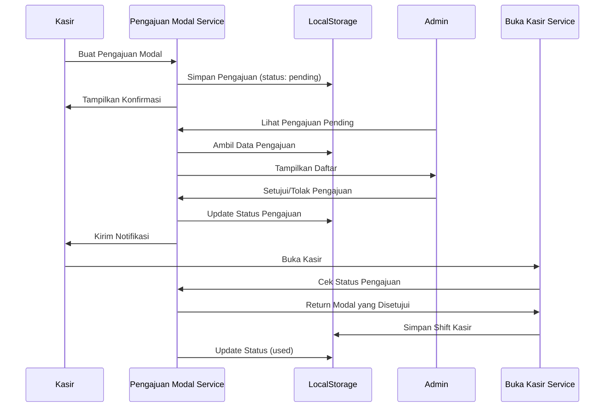

# Design Document - Pengajuan Modal Kasir

## Overview

Fitur pengajuan modal kasir adalah sistem workflow yang memungkinkan kasir untuk mengajukan permintaan modal awal kepada admin koperasi sebelum membuka shift kasir. Sistem ini mengimplementasikan approval workflow dengan notifikasi real-time, audit trail lengkap, dan integrasi dengan proses buka kasir yang sudah ada.

Fitur ini mengatasi masalah distribusi modal yang tidak terstruktur dengan menyediakan mekanisme formal untuk pengajuan, persetujuan, dan pelacakan modal kasir.

## Architecture

### High-Level Architecture

```
┌─────────────┐         ┌──────────────┐         ┌─────────────┐
│   Kasir     │────────>│   Pengajuan  │<────────│    Admin    │
│   (UI)      │         │    Modal     │         │    (UI)     │
└─────────────┘         │   Service    │         └─────────────┘
                        └──────────────┘
                               │
                               ├──> LocalStorage (Data Persistence)
                               ├──> Notification Service
                               └──> Audit Trail Service
```

### Component Interaction Flow



## Components and Interfaces

### 1. Pengajuan Modal Service (`js/pengajuanModal.js`)

Service utama yang mengelola seluruh lifecycle pengajuan modal.

```javascript
// Core Functions
function createPengajuanModal(kasirId, jumlah, keterangan)
function getPengajuanByKasir(kasirId)
function getPengajuanPending()
function approvePengajuan(pengajuanId, adminId)
function rejectPengajuan(pengajuanId, adminId, alasan)
function getPengajuanHistory(filters)
function markPengajuanAsUsed(pengajuanId, shiftId)
```

### 2. UI Components

#### Kasir UI (`renderPengajuanModalKasir()`)
- Form pengajuan modal
- Status pengajuan aktif
- Riwayat pengajuan kasir
- Notifikasi status

#### Admin UI (`renderKelolaPengajuanModal()`)
- Daftar pengajuan pending
- Detail pengajuan
- Form approval/rejection
- Filter dan pencarian
- Riwayat pengajuan

### 3. Integration Points

#### Buka Kasir Integration
Modifikasi fungsi `showBukaKasModal()` di `js/pos.js`:
- Cek pengajuan modal yang disetujui
- Auto-fill modal awal dari pengajuan
- Validasi sebelum buka kasir
- Update status pengajuan ke "used"

#### Notification Service
Sistem notifikasi untuk update status:
- Pengajuan disetujui
- Pengajuan ditolak
- Pengajuan baru (untuk admin)

## Data Models

### Pengajuan Modal Object

```javascript
{
  id: string,                    // UUID
  kasirId: string,               // ID user kasir
  kasirName: string,             // Nama kasir
  jumlahDiminta: number,         // Jumlah modal yang diminta
  keterangan: string,            // Keterangan pengajuan
  status: string,                // 'pending' | 'approved' | 'rejected' | 'used'
  tanggalPengajuan: string,      // ISO timestamp
  
  // Approval/Rejection data
  adminId: string | null,        // ID admin yang memproses
  adminName: string | null,      // Nama admin yang memproses
  tanggalProses: string | null,  // ISO timestamp
  alasanPenolakan: string | null,// Alasan jika ditolak
  
  // Usage tracking
  shiftId: string | null,        // ID shift kasir yang menggunakan
  tanggalDigunakan: string | null // ISO timestamp
}
```

### System Settings Extension

Tambahan konfigurasi di `systemSettings`:

```javascript
{
  pengajuanModal: {
    enabled: boolean,              // Enable/disable fitur
    batasMaximum: number,          // Batas maksimum pengajuan
    requireApproval: boolean,      // Wajib approval atau tidak
    autoApproveAmount: number      // Auto-approve jika <= amount ini
  }
}
```

## Correctness Properties

*A property is a characteristic or behavior that should hold true across all valid executions of a system-essentially, a formal statement about what the system should do. Properties serve as the bridge between human-readable specifications and machine-verifiable correctness guarantees.*

### Property 1: Pengajuan modal hanya dapat dibuat jika kasir tidak memiliki shift aktif

*For any* kasir, ketika membuat pengajuan modal baru, sistem harus memvalidasi bahwa kasir tersebut tidak memiliki shift kasir yang masih aktif (status 'buka')

**Validates: Requirements 5.1**

### Property 2: Pengajuan dengan status pending dapat diproses

*For any* pengajuan modal dengan status 'pending', admin harus dapat menyetujui atau menolak pengajuan tersebut, dan setelah diproses status harus berubah menjadi 'approved' atau 'rejected'

**Validates: Requirements 2.3, 2.4**

### Property 3: Jumlah modal yang diminta harus valid

*For any* pengajuan modal, jumlah yang diminta harus berupa angka positif lebih besar dari nol dan tidak melebihi batas maksimum yang ditentukan sistem

**Validates: Requirements 1.2, 5.2**

### Property 4: Penolakan pengajuan wajib memiliki alasan

*For any* pengajuan modal yang ditolak, harus terdapat alasan penolakan yang tidak kosong

**Validates: Requirements 2.4**

### Property 5: Pengajuan yang disetujui dapat digunakan untuk buka kasir

*For any* pengajuan modal dengan status 'approved', kasir harus dapat membuka shift kasir dengan modal awal sesuai jumlah yang disetujui, dan setelah digunakan status berubah menjadi 'used'

**Validates: Requirements 3.3, 3.5**

### Property 6: Kasir hanya dapat memiliki satu pengajuan pending

*For any* kasir, sistem harus mencegah pembuatan pengajuan baru jika kasir tersebut masih memiliki pengajuan dengan status 'pending'

**Validates: Requirements 1.5**

### Property 7: Audit trail tidak dapat diubah atau dihapus

*For any* pengajuan modal yang telah dibuat, semua perubahan status dan data terkait harus tercatat dalam audit trail yang immutable

**Validates: Requirements 4.5**

### Property 8: Notifikasi dikirim saat status berubah

*For any* pengajuan modal yang statusnya berubah dari 'pending' ke 'approved' atau 'rejected', sistem harus mengirim notifikasi kepada kasir yang mengajukan

**Validates: Requirements 3.1, 3.2**

### Property 9: Filter tanggal menampilkan pengajuan dalam rentang yang benar

*For any* filter periode tanggal yang dipilih admin, sistem harus menampilkan hanya pengajuan yang tanggal pengajuannya berada dalam rentang tersebut

**Validates: Requirements 4.2**

### Property 10: Admin hanya dapat memproses pengajuan dengan role yang sesuai

*For any* aksi approval atau rejection, sistem harus memvalidasi bahwa user yang melakukan aksi memiliki role 'admin', 'administrator', atau 'super_admin'

**Validates: Requirements 5.3**

## Error Handling

### Validation Errors

1. **Invalid Amount**
   - Error: "Jumlah modal harus lebih besar dari 0"
   - Error: "Jumlah modal melebihi batas maksimum Rp X"

2. **Active Shift**
   - Error: "Tidak dapat mengajukan modal. Anda masih memiliki shift kasir aktif"

3. **Pending Request**
   - Error: "Anda masih memiliki pengajuan modal yang menunggu persetujuan"

4. **Invalid Status**
   - Error: "Pengajuan tidak dapat diproses. Status tidak valid"

5. **Missing Rejection Reason**
   - Error: "Alasan penolakan harus diisi"

### System Errors

1. **Storage Error**
   - Rollback transaksi jika gagal menyimpan
   - Log error untuk debugging
   - Tampilkan pesan user-friendly

2. **Permission Error**
   - Error: "Anda tidak memiliki izin untuk melakukan aksi ini"

3. **Data Not Found**
   - Error: "Pengajuan tidak ditemukan"

### Error Recovery

- Semua operasi write menggunakan try-catch
- Rollback data jika terjadi error
- Audit trail untuk tracking error
- User feedback yang jelas

## Testing Strategy

### Unit Testing

Unit tests akan mencakup:

1. **Validation Tests**
   - Test validasi jumlah modal (positif, tidak melebihi batas)
   - Test validasi status pengajuan
   - Test validasi role admin
   - Test validasi shift aktif

2. **Business Logic Tests**
   - Test pembuatan pengajuan baru
   - Test approval pengajuan
   - Test rejection pengajuan
   - Test marking pengajuan as used
   - Test filter dan pencarian

3. **Integration Tests**
   - Test integrasi dengan buka kasir
   - Test integrasi dengan notification service
   - Test integrasi dengan audit trail

### Property-Based Testing

Property-based tests akan menggunakan **Jest** dengan library **fast-check** untuk JavaScript.

Setiap property test harus:
- Dikonfigurasi untuk menjalankan minimum 100 iterasi
- Diberi tag komentar yang mereferensikan correctness property dari design document
- Menggunakan format: `// Feature: pengajuan-modal-kasir, Property X: [property text]`

Property tests yang akan diimplementasikan:

1. **Property 1 Test**: Generate random kasir dengan berbagai status shift, validasi bahwa pengajuan hanya berhasil jika tidak ada shift aktif

2. **Property 2 Test**: Generate random pengajuan dengan status pending, validasi bahwa setelah diproses status berubah dengan benar

3. **Property 3 Test**: Generate random jumlah modal (termasuk negatif, nol, dan melebihi batas), validasi bahwa hanya jumlah valid yang diterima

4. **Property 4 Test**: Generate random rejection dengan berbagai alasan (termasuk string kosong), validasi bahwa rejection tanpa alasan ditolak

5. **Property 5 Test**: Generate random pengajuan approved, validasi bahwa dapat digunakan untuk buka kasir dan status berubah ke used

6. **Property 6 Test**: Generate random kasir, coba buat multiple pengajuan, validasi bahwa hanya satu pending diizinkan

7. **Property 7 Test**: Generate random pengajuan dan perubahan status, validasi bahwa audit trail lengkap dan tidak berubah

8. **Property 8 Test**: Generate random perubahan status, validasi bahwa notifikasi selalu dikirim

9. **Property 9 Test**: Generate random tanggal dan pengajuan, validasi bahwa filter mengembalikan hasil yang benar

10. **Property 10 Test**: Generate random users dengan berbagai role, validasi bahwa hanya admin yang dapat memproses

### Test Coverage Goals

- Unit test coverage: > 80%
- Property test coverage: 100% untuk semua correctness properties
- Integration test coverage: Semua critical paths

## Security Considerations

### Authorization

- Validasi role untuk setiap aksi
- Kasir hanya dapat melihat pengajuan sendiri
- Admin dapat melihat semua pengajuan
- Super admin memiliki akses penuh

### Data Validation

- Sanitize input untuk mencegah XSS
- Validasi tipe data
- Validasi range nilai
- Escape output saat render

### Audit Trail

- Log semua perubahan status
- Log user yang melakukan aksi
- Log timestamp setiap aksi
- Data audit immutable

## Performance Considerations

### Data Storage

- Gunakan indexed access untuk pencarian cepat
- Implementasi pagination untuk daftar besar
- Cache data yang sering diakses

### UI Responsiveness

- Lazy loading untuk riwayat
- Debounce untuk search input
- Optimistic UI updates
- Loading indicators

## Future Enhancements

1. **Multi-level Approval**
   - Approval bertingkat untuk jumlah besar
   - Workflow approval yang kompleks

2. **Notification Channels**
   - Email notification
   - SMS notification
   - Push notification

3. **Analytics Dashboard**
   - Statistik pengajuan modal
   - Trend analysis
   - Reporting

4. **Mobile App Integration**
   - Mobile approval
   - Mobile notification
   - Mobile dashboard

5. **Automated Approval**
   - Auto-approve berdasarkan kriteria
   - Machine learning untuk prediksi
   - Smart recommendation
