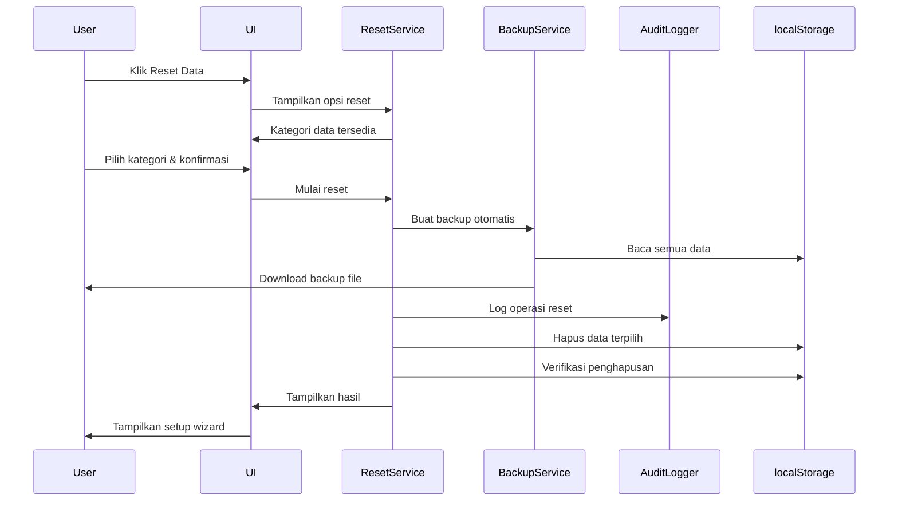

# Design Document - Reset Data Koperasi

## Overview

Fitur Reset Data Koperasi adalah sistem yang memungkinkan administrator untuk menghapus seluruh atau sebagian data dari aplikasi koperasi, sehingga aplikasi dapat digunakan kembali untuk koperasi yang berbeda atau untuk keperluan testing. Sistem ini dirancang dengan keamanan berlapis, backup otomatis, dan audit trail yang lengkap untuk mencegah kehilangan data yang tidak disengaja.

Fitur ini akan terintegrasi dengan sistem backup/restore yang sudah ada dan menggunakan arsitektur yang konsisten dengan modul-modul lain dalam aplikasi.

## Architecture

### High-Level Architecture

```
┌─────────────────────────────────────────────────────────────┐
│                    User Interface Layer                      │
│  ┌──────────────┐  ┌──────────────┐  ┌──────────────┐      │
│  │ Reset Page   │  │ Confirmation │  │ Progress     │      │
│  │ UI           │  │ Dialogs      │  │ Tracker      │      │
│  └──────────────┘  └──────────────┘  └──────────────┘      │
└─────────────────────────────────────────────────────────────┘
                            │
                            ▼
┌─────────────────────────────────────────────────────────────┐
│                   Business Logic Layer                       │
│  ┌──────────────┐  ┌──────────────┐  ┌──────────────┐      │
│  │ Reset        │  │ Category     │  │ Validation   │      │
│  │ Service      │  │ Manager      │  │ Service      │      │
│  └──────────────┘  └──────────────┘  └──────────────┘      │
└─────────────────────────────────────────────────────────────┘
                            │
                            ▼
┌─────────────────────────────────────────────────────────────┐
│                    Integration Layer                         │
│  ┌──────────────┐  ┌──────────────┐  ┌──────────────┐      │
│  │ Backup       │  │ Audit        │  │ Setup        │      │
│  │ Service      │  │ Logger       │  │ Wizard       │      │
│  └──────────────┘  └──────────────┘  └──────────────┘      │
└─────────────────────────────────────────────────────────────┘
                            │
                            ▼
┌─────────────────────────────────────────────────────────────┐
│                      Storage Layer                           │
│                    (localStorage)                            │
└─────────────────────────────────────────────────────────────┘
```

### Component Interaction Flow



## Components and Interfaces

### 1. ResetService Class

Service utama yang mengelola operasi reset data.

```javascript
class ResetService {
    constructor() {
        this.categoryManager = new CategoryManager();
        this.backupService = new BackupService();
        this.auditLogger = new AuditLogger();
        this.validationService = new ResetValidationService();
    }

    /**
     * Get available data categories for reset
     * @returns {Array<CategoryInfo>} List of categories with metadata
     */
    getAvailableCategories()

    /**
     * Validate reset request
     * @param {ResetRequest} request - Reset request object
     * @returns {ValidationResult} Validation result
     */
    validateResetRequest(request)

    /**
     * Execute reset operation
     * @param {ResetRequest} request - Reset request object
     * @param {ProgressCallback} onProgress - Progress callback
     * @returns {Promise<ResetResult>} Reset result
     */
    async executeReset(request, onProgress)

    /**
     * Perform dry-run reset (testing mode)
     * @param {ResetRequest} request - Reset request object
     * @returns {DryRunResult} Simulation result
     */
    performDryRun(request)

    /**
     * Verify reset completion
     * @param {Array<string>} categories - Categories that were reset
     * @returns {VerificationResult} Verification result
     */
    verifyResetCompletion(categories)
}
```

### 2. CategoryManager Class

Mengelola kategori data dan metadata terkait.

```javascript
class CategoryManager {
    /**
     * Get all data categories with counts
     * @returns {Array<CategoryInfo>} Categories with metadata
     */
    getAllCategories()

    /**
     * Get category groups (Master Data, Transaction Data, System Settings)
     * @returns {Object} Grouped categories
     */
    getCategoryGroups()

    /**
     * Get localStorage keys for a category
     * @param {string} category - Category name
     * @returns {Array<string>} localStorage keys
     */
    getKeysForCategory(category)

    /**
     * Calculate size for categories
     * @param {Array<string>} categories - Category names
     * @returns {number} Total size in bytes
     */
    calculateSize(categories)

    /**
     * Get dependencies between categories
     * @param {string} category - Category name
     * @returns {Array<string>} Dependent categories
     */
    getDependencies(category)
}
```

### 3. ResetValidationService Class

Validasi untuk operasi reset.

```javascript
class ResetValidationService {
    /**
     * Validate user permissions
     * @param {User} user - Current user
     * @returns {boolean} Has permission
     */
    validatePermissions(user)

    /**
     * Validate category selection
     * @param {Array<string>} categories - Selected categories
     * @returns {ValidationResult} Validation result
     */
    validateCategorySelection(categories)

    /**
     * Check for data dependencies
     * @param {Array<string>} categories - Categories to reset
     * @returns {DependencyCheckResult} Dependency check result
     */
    checkDependencies(categories)

    /**
     * Validate confirmation input
     * @param {string} input - User input
     * @param {string} expected - Expected confirmation text
     * @returns {boolean} Is valid
     */
    validateConfirmation(input, expected)
}
```

### 4. SetupWizardService Class

Panduan setup setelah reset.

```javascript
class SetupWizardService {
    /**
     * Get setup steps
     * @returns {Array<SetupStep>} Setup steps
     */
    getSetupSteps()

    /**
     * Check if step is completed
     * @param {string} stepId - Step identifier
     * @returns {boolean} Is completed
     */
    isStepCompleted(stepId)

    /**
     * Mark step as completed
     * @param {string} stepId - Step identifier
     */
    completeStep(stepId)

    /**
     * Get setup progress
     * @returns {SetupProgress} Progress information
     */
    getProgress()

    /**
     * Reset setup wizard
     */
    resetWizard()
}
```

## Data Models

### ResetRequest

```javascript
{
    type: 'full' | 'selective',  // Reset type
    categories: string[],         // Categories to reset (empty for full)
    createBackup: boolean,        // Create backup before reset
    testMode: boolean,            // Dry-run mode
    userId: string,               // User performing reset
    timestamp: string,            // ISO 8601 timestamp
    reason: string                // Optional reason for reset
}
```

### CategoryInfo

```javascript
{
    key: string,                  // localStorage key prefix
    label: string,                // Display name
    group: string,                // Category group
    count: number,                // Number of records
    size: number,                 // Size in bytes
    dependencies: string[],       // Dependent categories
    protected: boolean            // Cannot be deleted (e.g., current session)
}
```

### ResetResult

```javascript
{
    success: boolean,
    message: string,
    deleted: {
        categories: string[],
        recordCount: number,
        totalSize: number
    },
    backup: {
        created: boolean,
        filename: string,
        size: number
    },
    errors: string[],
    warnings: string[],
    duration: number,             // Milliseconds
    timestamp: string
}
```

### SetupStep

```javascript
{
    id: string,
    title: string,
    description: string,
    route: string,                // Navigation route
    required: boolean,
    completed: boolean,
    order: number
}
```

## Correctness Properties

*A property is a characteristic or behavior that should hold true across all valid executions of a system-essentially, a formal statement about what the system should do. Properties serve as the bridge between human-readable specifications and machine-verifiable correctness guarantees.*

### Property Reflection

After analyzing all acceptance criteria, several properties can be consolidated to avoid redundancy:

- Properties 2.2, 2.3, 2.4, 2.5 all test UI state management and can be combined into comprehensive UI state properties
- Properties 3.1-3.5 all relate to backup creation and can be consolidated into backup workflow properties
- Properties 4.1-4.5 all test confirmation flow and can be combined into confirmation sequence properties
- Properties 6.1-6.5 all test data deletion and can be consolidated into deletion verification properties
- Properties 7.1-7.5 all test audit logging and can be combined into audit trail properties

### Core Properties

**Property 1: Selective reset UI state consistency**
*For any* reset page state, when selective mode is chosen, all category checkboxes should be displayed, and the reset button should be enabled if and only if at least one category is selected
**Validates: Requirements 2.2, 2.3, 2.5**

**Property 2: Full reset auto-selection**
*For any* set of available categories, when "Reset Semua Data" is selected, all category checkboxes should be automatically checked
**Validates: Requirements 2.4**

**Property 3: Backup creation before reset**
*For any* reset operation, a complete backup of all localStorage data must be created and successfully downloaded before any data deletion occurs
**Validates: Requirements 3.1, 3.3, 3.5**

**Property 4: Backup timestamp format**
*For any* backup file created, the timestamp in metadata must be a valid ISO 8601 formatted string
**Validates: Requirements 3.2**

**Property 5: Reset cancellation on backup failure**
*For any* reset operation where backup creation fails, the reset process must be cancelled and no data should be deleted
**Validates: Requirements 3.4**

**Property 6: Confirmation sequence integrity**
*For any* reset initiation, two sequential confirmation dialogs must be shown, and the second dialog's confirm button should be enabled if and only if the user enters the exact confirmation text
**Validates: Requirements 4.1, 4.2, 4.3, 4.4**

**Property 7: Progress tracking completeness**
*For any* reset operation, the progress bar should update for each category processed, and the final progress should equal 100% when all selected categories are processed
**Validates: Requirements 5.1, 5.2, 5.4**

**Property 8: UI locking during reset**
*For any* active reset operation, all interactive UI elements (buttons, navigation) should be disabled until the operation completes or fails
**Validates: Requirements 5.3**

**Property 9: Error handling with rollback**
*For any* reset operation that encounters an error, the process should stop immediately, display error details, and no further categories should be deleted
**Validates: Requirements 5.5**

**Property 10: Category-specific key deletion**
*For any* selected category, all and only the localStorage keys belonging to that category should be deleted, verified by post-deletion check
**Validates: Requirements 6.1, 6.2, 6.3, 6.4**

**Property 11: Session preservation in full reset**
*For any* full reset operation, all localStorage keys should be deleted except the current user session key
**Validates: Requirements 6.5**

**Property 12: Comprehensive audit trail**
*For any* reset operation, audit log entries must be created at start (with user, timestamp, categories), during each category deletion (with count), and at completion (with status, duration)
**Validates: Requirements 7.1, 7.2, 7.3, 7.4**

**Property 13: Audit log exportability**
*For any* audit log entry created, it must be stored in a format that can be exported to JSON
**Validates: Requirements 7.5**

**Property 14: Backup preview accuracy**
*For any* selected backup file, the preview should display accurate metadata including category counts that match the actual data in the backup
**Validates: Requirements 8.2**

**Property 15: Restore data integrity**
*For any* successful restore operation, all data from the backup must be loaded into localStorage and pass integrity verification
**Validates: Requirements 8.3, 8.4**

**Property 16: Restore failure safety**
*For any* restore operation that fails, the existing localStorage data must remain unchanged
**Validates: Requirements 8.5**

**Property 17: Post-reset setup wizard**
*For any* successfully completed reset operation, the setup wizard should be displayed with all required setup steps
**Validates: Requirements 9.1**

**Property 18: Setup wizard navigation**
*For any* setup wizard checklist item clicked, the system should navigate to the corresponding configuration page
**Validates: Requirements 9.3**

**Property 19: Setup completion tracking**
*For any* setup wizard state where all required steps are marked complete, the overall setup status should be marked as complete
**Validates: Requirements 9.4**

**Property 20: Post-reset login message**
*For any* login attempt after a reset operation, a notification message should be displayed indicating the system was reset
**Validates: Requirements 9.5**

**Property 21: Dry-run non-destructive**
*For any* reset operation in test mode, no actual localStorage keys should be deleted, but simulation results should be generated
**Validates: Requirements 10.1, 10.2, 10.3**

**Property 22: Test mode indicator**
*For any* page rendered while test mode is active, a "TEST MODE" badge should be visible in the header
**Validates: Requirements 10.4**

**Property 23: Test mode deactivation confirmation**
*For any* attempt to deactivate test mode, an administrator confirmation dialog must be shown before mode change
**Validates: Requirements 10.5**

## Error Handling

### Error Categories

1. **Permission Errors**
   - User tidak memiliki role administrator/super_admin
   - Session expired atau invalid
   - Handling: Tampilkan pesan error, redirect ke login jika perlu

2. **Validation Errors**
   - Tidak ada kategori yang dipilih
   - Konfirmasi text tidak sesuai
   - Handling: Tampilkan pesan validasi, disable tombol action

3. **Backup Errors**
   - Gagal membaca localStorage
   - Gagal membuat file backup
   - Browser storage quota exceeded
   - Handling: Cancel reset operation, tampilkan error detail

4. **Deletion Errors**
   - Gagal menghapus localStorage key
   - Partial deletion (beberapa key gagal)
   - Handling: Stop operation, log error, tampilkan kategori yang gagal

5. **Restore Errors**
   - File backup corrupt atau invalid
   - Format backup tidak sesuai
   - Verifikasi integritas gagal
   - Handling: Cancel restore, preserve existing data, tampilkan error

6. **Audit Errors**
   - Gagal menulis audit log
   - Handling: Log to console, continue operation (non-blocking)

### Error Recovery Strategies

```javascript
// Backup failure recovery
if (backupFailed) {
    // Cancel reset immediately
    // Show detailed error message
    // Suggest troubleshooting steps
    // Do not proceed with deletion
}

// Partial deletion recovery
if (partialDeletionError) {
    // Stop further deletions
    // Log which categories succeeded/failed
    // Show detailed error report
    // Offer to retry failed categories
}

// Restore failure recovery
if (restoreFailed) {
    // Do not modify existing data
    // Show error with backup file details
    // Suggest file validation
    // Offer to try different backup file
}
```

## Testing Strategy

### Unit Testing

Unit tests will cover specific functions and edge cases:

1. **CategoryManager Tests**
   - Test category grouping logic
   - Test key mapping for each category
   - Test size calculation accuracy
   - Test dependency resolution

2. **ResetValidationService Tests**
   - Test permission validation with different roles
   - Test category selection validation (empty, invalid)
   - Test confirmation text validation (case sensitivity, whitespace)
   - Test dependency checking logic

3. **ResetService Tests**
   - Test dry-run mode (no actual deletion)
   - Test backup creation before reset
   - Test error handling for each error type
   - Test verification logic

4. **SetupWizardService Tests**
   - Test step completion tracking
   - Test progress calculation
   - Test step ordering

### Property-Based Testing

Property-based tests will verify universal properties across all inputs using **fast-check** library for JavaScript. Each test will run a minimum of 100 iterations.

1. **UI State Properties (Properties 1, 2)**
   - Generate random category selections
   - Verify button states match selection rules
   - Verify auto-selection behavior

2. **Backup Properties (Properties 3, 4, 5)**
   - Generate random localStorage states
   - Verify backup creation and format
   - Verify cancellation on failure

3. **Confirmation Properties (Property 6)**
   - Generate random confirmation inputs
   - Verify button enable/disable logic
   - Verify sequence integrity

4. **Progress Properties (Properties 7, 8)**
   - Generate random category lists
   - Verify progress updates
   - Verify UI locking

5. **Deletion Properties (Properties 10, 11)**
   - Generate random category selections
   - Verify correct keys deleted
   - Verify session preservation

6. **Audit Properties (Properties 12, 13)**
   - Generate random reset operations
   - Verify audit entries created
   - Verify log format

7. **Restore Properties (Properties 14, 15, 16)**
   - Generate random backup files
   - Verify preview accuracy
   - Verify restore integrity
   - Verify failure safety

8. **Setup Wizard Properties (Properties 17, 18, 19)**
   - Generate random setup states
   - Verify wizard display
   - Verify completion tracking

9. **Test Mode Properties (Properties 21, 22, 23)**
   - Generate random reset requests in test mode
   - Verify non-destructive behavior
   - Verify mode indicators

### Integration Testing

Integration tests will verify end-to-end workflows:

1. **Full Reset Flow**
   - Navigate to reset page
   - Select full reset
   - Complete confirmation dialogs
   - Verify backup created
   - Verify all data deleted (except session)
   - Verify setup wizard shown

2. **Selective Reset Flow**
   - Select specific categories
   - Complete confirmation
   - Verify only selected categories deleted
   - Verify other data preserved

3. **Restore Flow**
   - Upload backup file
   - Preview backup
   - Confirm restore
   - Verify data restored
   - Verify integrity check

4. **Error Scenarios**
   - Test backup failure handling
   - Test deletion error handling
   - Test restore error handling

### Test Configuration

```javascript
// fast-check configuration for property tests
const fc = require('fast-check');

const testConfig = {
    numRuns: 100,  // Minimum iterations per property
    verbose: true,
    seed: Date.now()
};

// Example property test structure
describe('Reset Data Koperasi - Property Tests', () => {
    it('Property 10: Category-specific key deletion', () => {
        fc.assert(
            fc.property(
                fc.array(fc.constantFrom(...availableCategories)),
                (selectedCategories) => {
                    // Test implementation
                }
            ),
            testConfig
        );
    });
});
```

## Security Considerations

1. **Authentication & Authorization**
   - Only super_admin role can access reset functionality
   - Session validation before every operation
   - Re-authentication for sensitive operations

2. **Confirmation Requirements**
   - Multi-level confirmation dialogs
   - Typed confirmation text (prevents accidental clicks)
   - Clear warning messages

3. **Audit Trail**
   - All reset operations logged with user ID
   - Timestamps for all actions
   - Cannot be disabled or bypassed

4. **Data Protection**
   - Automatic backup before reset
   - Backup includes all data for recovery
   - Session data preserved during reset

5. **Rate Limiting**
   - Prevent rapid repeated reset operations
   - Cooldown period between resets
   - Log suspicious activity

## Performance Considerations

1. **Large Dataset Handling**
   - Progress tracking for user feedback
   - Chunked processing for large categories
   - Async operations to prevent UI blocking

2. **Backup File Size**
   - Warn user if backup > 5MB
   - Compression for large backups (optional)
   - Streaming for very large datasets

3. **localStorage Limits**
   - Check available space before restore
   - Handle quota exceeded errors gracefully
   - Suggest cleanup if space low

4. **UI Responsiveness**
   - Use Web Workers for heavy operations (optional)
   - Debounce UI updates during progress
   - Disable interactions during processing

## Implementation Notes

1. **Integration with Existing Systems**
   - Reuse BackupService from js/backup.js
   - Reuse AuditLogger from js/auditLogger.js
   - Follow existing UI patterns and styling

2. **localStorage Key Conventions**
   - Document all key prefixes and patterns
   - Maintain category-to-key mapping
   - Handle legacy keys gracefully

3. **Browser Compatibility**
   - Test on Chrome, Firefox, Edge, Safari
   - Handle localStorage API differences
   - Provide fallbacks for unsupported features

4. **User Experience**
   - Clear, non-technical error messages
   - Progress indicators for all operations
   - Helpful tooltips and documentation links
   - Confirmation dialogs with detailed impact info

5. **Maintenance**
   - Version tracking for reset operations
   - Migration support for schema changes
   - Backward compatibility with old backups

