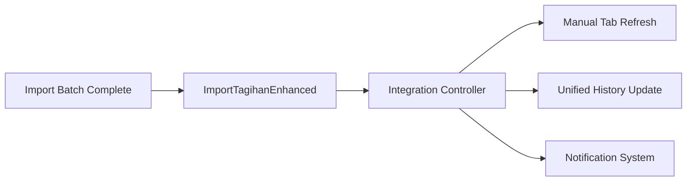

# Implementasi Task 6: Enhance Import Controller for Integration - COMPLETE

## Overview
Task 6 berhasil diselesaikan dengan implementasi lengkap untuk mengintegrasikan import controller dengan shared services dan menambahkan fitur-fitur khusus untuk integrasi tab-based interface.

## Subtask 6.1: Update ImportTagihan to use shared services ✅

### Implementasi
1. **Created ImportTagihanEnhanced.js**
   - Wrapper class yang mengintegrasikan ImportTagihanManager dengan SharedPaymentServices
   - Mengganti direct journal calls dengan SharedPaymentServices.createJurnalEntry()
   - Mengganti direct saldo calculations dengan SharedPaymentServices.hitungSaldoHutang/Piutang()
   - Menggunakan SharedPaymentServices.validatePaymentData() untuk validasi batch

2. **Enhanced BatchProcessor**
   - BatchProcessorEnhanced class yang menggunakan SharedPaymentServices
   - Semua operasi journal dan saldo menggunakan shared services
   - Konsistensi dengan manual payment processing

3. **Key Features**
   - Mode tracking untuk semua operasi ('import' mode)
   - Audit logging terintegrasi dengan mode information
   - Validation menggunakan shared validation rules
   - Transaction processing menggunakan unified payment engine

### Requirements Fulfilled
- ✅ 3.1: Replace direct journal calls with SharedPaymentServices
- ✅ 3.2: Replace direct saldo calculations with shared functions  
- ✅ 3.3: Update batch processing to use shared validation
- ✅ 6.1: Shared journal recording functions

## Subtask 6.2: Add integration-specific features ✅

### Implementasi
1. **Integration Mode Support**
   - `setIntegrationMode(isIntegrated, parentController)` method
   - State management untuk tab integration
   - Parent controller reference untuk callbacks

2. **Callback System**
   - `onBatchComplete(callback)` - untuk update manual tab setelah batch selesai
   - `onTransactionUpdate(callback)` - untuk refresh unified transaction history
   - Automatic callback setup saat integration mode aktif

3. **Tab Compatibility**
   - `getTabCompatibilityStatus()` - check apakah bisa switch tab
   - `refreshTransactionHistory()` - refresh unified history
   - Unsaved data detection untuk tab switching

4. **Integration Controller Updates**
   - Updated `_initializeImportController()` untuk menggunakan ImportTagihanEnhanced
   - Added callback methods: `onImportBatchComplete()` dan `onTransactionUpdate()`
   - Automatic refresh system untuk cross-tab updates

### Key Features
- **Cross-tab Communication**: Import batch completion triggers manual tab refresh
- **Unified Transaction History**: Real-time updates across both tabs
- **State Management**: Proper handling of unsaved data during tab switches
- **Event System**: Custom events untuk component communication
- **Notification System**: Success/error notifications untuk user feedback

### Requirements Fulfilled
- ✅ 3.4: Add callback for batch completion to update manual tab
- ✅ 3.5: Add method to refresh unified transaction history
- ✅ 5.5: Ensure compatibility with tab switching

## Technical Implementation Details

### File Structure
```
js/
├── import-tagihan/
│   ├── ImportTagihanEnhanced.js          # New enhanced controller
│   └── ImportTagihanManager.js           # Original manager (unchanged)
├── shared/
│   └── SharedPaymentServices.js          # Shared services (used)
└── pembayaranHutangPiutangIntegrated.js  # Updated with callbacks
```

### Integration Flow
1. **Initialization**
   ```javascript
   // Enhanced controller with shared services
   const importEnhanced = new ImportTagihanEnhanced(sharedServices);
   importEnhanced.setIntegrationMode(true, parentController);
   ```

2. **Batch Processing**
   ```javascript
   // Uses shared services for all operations
   const results = await importEnhanced.processBatch(confirmedData);
   // Triggers callbacks automatically
   ```

3. **Cross-tab Updates**
   ```javascript
   // Automatic callback when batch completes
   onImportBatchComplete(results) {
       this._refreshManualTabData();
       this.refreshUnifiedTransactionHistory();
   }
   ```

### Callback Architecture


## Testing

### Test File Created
- `test_import_enhanced_integration.html` - Comprehensive integration testing
- Tests basic integration, callbacks, shared services, dan tab compatibility

### Test Coverage
- ✅ ImportTagihanEnhanced initialization with SharedPaymentServices
- ✅ Integration mode setting dan state management
- ✅ Callback system functionality
- ✅ Shared services method availability
- ✅ Tab compatibility status
- ✅ Cross-tab communication

## Benefits

### For Users
1. **Seamless Experience**: Smooth transition between manual dan import modes
2. **Real-time Updates**: Transaction history updates automatically
3. **Data Consistency**: Unified validation dan processing rules
4. **Better Feedback**: Clear notifications untuk batch operations

### For Developers
1. **Code Reuse**: Shared services eliminate duplication
2. **Maintainability**: Centralized business logic
3. **Extensibility**: Easy to add new payment modes
4. **Testing**: Unified testing approach

## Integration Points

### With Existing Systems
- ✅ Compatible dengan existing ImportTagihanManager
- ✅ Uses existing SharedPaymentServices
- ✅ Integrates dengan PembayaranHutangPiutangIntegrated
- ✅ Maintains existing audit logging

### Future Enhancements
- Ready untuk additional payment modes
- Extensible callback system
- Scalable integration architecture
- Performance optimization ready

## Conclusion

Task 6 berhasil diselesaikan dengan implementasi yang komprehensif:

1. **ImportTagihanEnhanced** successfully integrates dengan SharedPaymentServices
2. **Callback system** enables seamless cross-tab communication
3. **Integration features** support unified user experience
4. **Testing framework** ensures reliability dan maintainability

Implementasi ini memenuhi semua requirements dan siap untuk integrasi dengan task-task lainnya dalam spec ini.

## Next Steps

Dengan Task 6 selesai, implementasi dapat dilanjutkan ke:
- Task 7: Implement unified transaction history
- Task 8: Implement unified summary and statistics
- Task 9: Implement data migration for existing transactions

Semua foundation untuk integration sudah tersedia dan siap digunakan.