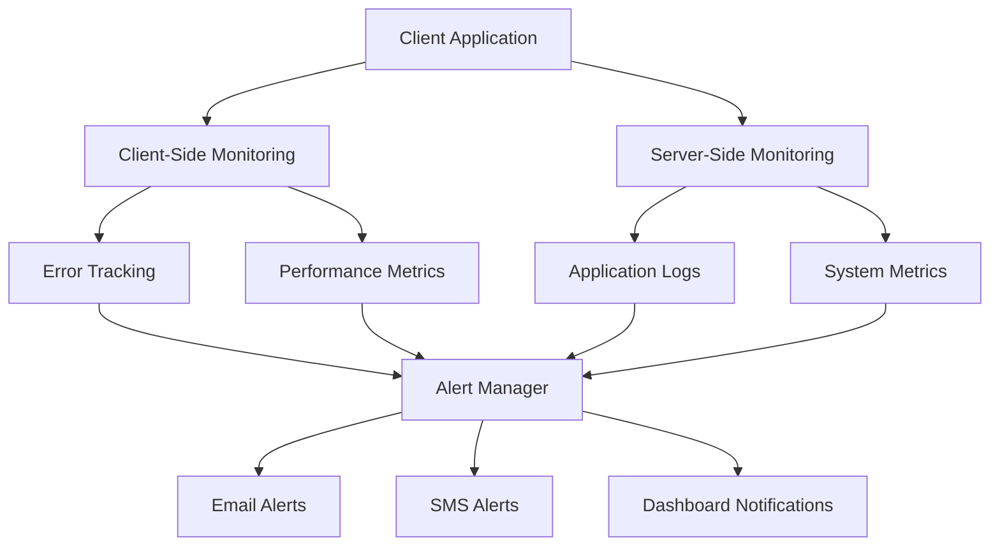

# Monitoring & Alerting Configuration - Integrasi Pembayaran Laporan

## Overview

This document outlines the comprehensive monitoring and alerting strategy for the Integrasi Pembayaran Laporan feature. It includes application performance monitoring, error tracking, business metrics, and automated alerting systems.

## Monitoring Architecture



## Client-Side Monitoring

### 1. Error Tracking Implementation

```javascript
// js/monitoring/ErrorTracker.js
class ErrorTracker {
    constructor() {
        this.errorQueue = [];
        this.maxQueueSize = 100;
        this.flushInterval = 30000; // 30 seconds
        this.setupErrorHandlers();
        this.startPeriodicFlush();
    }
    
    setupErrorHandlers() {
        // Global error handler
        window.addEventListener('error', (event) => {
            this.trackError({
                type: 'javascript_error',
                message: event.message,
                filename: event.filename,
                lineno: event.lineno,
                colno: event.colno,
                stack: event.error?.stack,
                timestamp: new Date().toISOString(),
                url: window.location.href,
                userAgent: navigator.userAgent
            });
        });
        
        // Unhandled promise rejection handler
        window.addEventListener('unhandledrejection', (event) => {
            this.trackError({
                type: 'unhandled_promise_rejection',
                message: event.reason?.message || 'Unhandled Promise Rejection',
                stack: event.reason?.stack,
                timestamp: new Date().toISOString(),
                url: window.location.href
            });
        });
    }
    
    trackError(errorData) {
        // Add context information
        const enrichedError = {
            ...errorData,
            sessionId: this.getSessionId(),
            userId: this.getCurrentUserId(),
            feature: 'integrasi-pembayaran-laporan',
            activeTab: this.getActiveTab(),
            browserInfo: this.getBrowserInfo()
        };
        
        this.errorQueue.push(enrichedError);
        
        // Immediate flush for critical errors
        if (this.isCriticalError(errorData)) {
            this.flushErrors();
        }
        
        // Manage queue size
        if (this.errorQueue.length > this.maxQueueSize) {
            this.errorQueue.shift();
        }
    }
    
    isCriticalError(error) {
        const criticalPatterns = [
            /payment.*failed/i,
            /transaction.*error/i,
            /saldo.*inconsistent/i,
            /journal.*error/i,
            /authentication.*failed/i
        ];
        
        return criticalPatterns.some(pattern => 
            pattern.test(error.message) || pattern.test(error.stack)
        );
    }
    
    flushErrors() {
        if (this.errorQueue.length === 0) return;
        
        const errors = [...this.errorQueue];
        this.errorQueue = [];
        
        // Send to monitoring service
        this.sendToMonitoringService(errors);
        
        // Store locally as backup
        this.storeErrorsLocally(errors);
    }
    
    sendToMonitoringService(errors) {
        // Implementation depends on monitoring service used
        // Example for custom endpoint:
        fetch('/api/monitoring/errors', {
            method: 'POST',
            headers: {
                'Content-Type': 'application/json'
            },
            body: JSON.stringify({
                errors: errors,
                timestamp: new Date().toISOString()
            })
        }).catch(err => {
            console.error('Failed to send errors to monitoring service:', err);
        });
    }
    
    getActiveTab() {
        const activeTab = document.querySelector('.tab-btn.active');
        return activeTab ? activeTab.dataset.tab : 'unknown';
    }
    
    getSessionId() {
        return sessionStorage.getItem('sessionId') || 'anonymous';
    }
    
    getCurrentUserId() {
        return localStorage.getItem('currentUser') || 'anonymous';
    }
    
    getBrowserInfo() {
        return {
            userAgent: navigator.userAgent,
            language: navigator.language,
            platform: navigator.platform,
            cookieEnabled: navigator.cookieEnabled,
            onLine: navigator.onLine
        };
    }
}

// Initialize error tracking
window.errorTracker = new ErrorTracker();
```

### 2. Performance Monitoring

```javascript
// js/monitoring/PerformanceMonitor.js
class PerformanceMonitor {
    constructor() {
        this.metrics = [];
        this.setupPerformanceObserver();
        this.trackCustomMetrics();
    }
    
    setupPerformanceObserver() {
        if ('PerformanceObserver' in window) {
            // Track navigation timing
            const navObserver = new PerformanceObserver((list) => {
                for (const entry of list.getEntries()) {
                    this.trackMetric({
                        type: 'navigation',
                        name: entry.name,
                        duration: entry.duration,
                        startTime: entry.startTime,
                        timestamp: new Date().toISOString()
                    });
                }
            });
            navObserver.observe({ entryTypes: ['navigation'] });
            
            // Track resource loading
            const resourceObserver = new PerformanceObserver((list) => {
                for (const entry of list.getEntries()) {
                    if (entry.name.includes('.js') || entry.name.includes('.css')) {
                        this.trackMetric({
                            type: 'resource',
                            name: entry.name,
                            duration: entry.duration,
                            size: entry.transferSize,
                            timestamp: new Date().toISOString()
                        });
                    }
                }
            });
            resourceObserver.observe({ entryTypes: ['resource'] });
        }
    }
    
    trackCustomMetrics() {
        // Track tab switching performance
        this.trackTabSwitchPerformance();
        
        // Track payment processing performance
        this.trackPaymentPerformance();
        
        // Track import batch performance
        this.trackImportPerformance();
    }
    
    trackTabSwitchPerformance() {
        const originalSwitchTab = window.switchTab;
        if (originalSwitchTab) {
            window.switchTab = (tabName) => {
                const startTime = performance.now();
                const result = originalSwitchTab.call(this, tabName);
                const endTime = performance.now();
                
                this.trackMetric({
                    type: 'tab_switch',
                    tabName: tabName,
                    duration: endTime - startTime,
                    timestamp: new Date().toISOString()
                });
                
                return result;
            };
        }
    }
    
    trackPaymentPerformance() {
        // Override payment processing functions to track performance
        const originalProcessPayment = window.processPayment;
        if (originalProcessPayment) {
            window.processPayment = async (...args) => {
                const startTime = performance.now();
                try {
                    const result = await originalProcessPayment.apply(this, args);
                    const endTime = performance.now();
                    
                    this.trackMetric({
                        type: 'payment_processing',
                        mode: 'manual',
                        duration: endTime - startTime,
                        success: true,
                        timestamp: new Date().toISOString()
                    });
                    
                    return result;
                } catch (error) {
                    const endTime = performance.now();
                    
                    this.trackMetric({
                        type: 'payment_processing',
                        mode: 'manual',
                        duration: endTime - startTime,
                        success: false,
                        error: error.message,
                        timestamp: new Date().toISOString()
                    });
                    
                    throw error;
                }
            };
        }
    }
    
    trackImportPerformance() {
        // Track import batch processing performance
        const originalProcessBatch = window.processBatchPayments;
        if (originalProcessBatch) {
            window.processBatchPayments = async (...args) => {
                const startTime = performance.now();
                const batchSize = args[0]?.length || 0;
                
                try {
                    const result = await originalProcessBatch.apply(this, args);
                    const endTime = performance.now();
                    
                    this.trackMetric({
                        type: 'batch_processing',
                        mode: 'import',
                        batchSize: batchSize,
                        duration: endTime - startTime,
                        success: true,
                        timestamp: new Date().toISOString()
                    });
                    
                    return result;
                } catch (error) {
                    const endTime = performance.now();
                    
                    this.trackMetric({
                        type: 'batch_processing',
                        mode: 'import',
                        batchSize: batchSize,
                        duration: endTime - startTime,
                        success: false,
                        error: error.message,
                        timestamp: new Date().toISOString()
                    });
                    
                    throw error;
                }
            };
        }
    }
    
    trackMetric(metric) {
        this.metrics.push(metric);
        
        // Check for performance issues
        this.checkPerformanceThresholds(metric);
        
        // Manage metrics array size
        if (this.metrics.length > 1000) {
            this.flushMetrics();
        }
    }
    
    checkPerformanceThresholds(metric) {
        const thresholds = {
            tab_switch: 1000, // 1 second
            payment_processing: 5000, // 5 seconds
            batch_processing: 30000, // 30 seconds
            navigation: 3000, // 3 seconds
            resource: 2000 // 2 seconds
        };
        
        const threshold = thresholds[metric.type];
        if (threshold && metric.duration > threshold) {
            this.triggerPerformanceAlert(metric, threshold);
        }
    }
    
    triggerPerformanceAlert(metric, threshold) {
        const alert = {
            type: 'performance_degradation',
            metric: metric,
            threshold: threshold,
            severity: metric.duration > threshold * 2 ? 'high' : 'medium',
            timestamp: new Date().toISOString()
        };
        
        window.errorTracker?.trackError(alert);
    }
    
    flushMetrics() {
        if (this.metrics.length === 0) return;
        
        const metrics = [...this.metrics];
        this.metrics = [];
        
        // Send to monitoring service
        fetch('/api/monitoring/metrics', {
            method: 'POST',
            headers: {
                'Content-Type': 'application/json'
            },
            body: JSON.stringify({
                metrics: metrics,
                timestamp: new Date().toISOString()
            })
        }).catch(err => {
            console.error('Failed to send metrics to monitoring service:', err);
        });
    }
}

// Initialize performance monitoring
window.performanceMonitor = new PerformanceMonitor();
```

### 3. Business Metrics Tracking

```javascript
// js/monitoring/BusinessMetrics.js
class BusinessMetrics {
    constructor() {
        this.setupBusinessTracking();
    }
    
    setupBusinessTracking() {
        // Track payment transactions
        this.trackPaymentTransactions();
        
        // Track user interactions
        this.trackUserInteractions();
        
        // Track feature usage
        this.trackFeatureUsage();
    }
    
    trackPaymentTransactions() {
        // Override transaction creation to track business metrics
        const originalCreateTransaction = window.createTransaction;
        if (originalCreateTransaction) {
            window.createTransaction = (transactionData) => {
                const result = originalCreateTransaction.call(this, transactionData);
                
                this.trackBusinessEvent({
                    type: 'transaction_created',
                    mode: transactionData.mode || 'manual',
                    amount: transactionData.jumlah,
                    paymentType: transactionData.jenisPembayaran,
                    timestamp: new Date().toISOString(),
                    userId: this.getCurrentUserId(),
                    sessionId: this.getSessionId()
                });
                
                return result;
            };
        }
    }
    
    trackUserInteractions() {
        // Track tab switches
        document.addEventListener('click', (event) => {
            if (event.target.classList.contains('tab-btn')) {
                this.trackBusinessEvent({
                    type: 'tab_switch',
                    fromTab: document.querySelector('.tab-btn.active')?.dataset.tab,
                    toTab: event.target.dataset.tab,
                    timestamp: new Date().toISOString(),
                    userId: this.getCurrentUserId()
                });
            }
        });
        
        // Track form submissions
        document.addEventListener('submit', (event) => {
            const form = event.target;
            if (form.id === 'pembayaran-form') {
                this.trackBusinessEvent({
                    type: 'payment_form_submitted',
                    mode: 'manual',
                    timestamp: new Date().toISOString(),
                    userId: this.getCurrentUserId()
                });
            }
        });
        
        // Track file uploads
        document.addEventListener('change', (event) => {
            if (event.target.type === 'file' && event.target.files.length > 0) {
                this.trackBusinessEvent({
                    type: 'file_uploaded',
                    mode: 'import',
                    fileSize: event.target.files[0].size,
                    fileName: event.target.files[0].name,
                    timestamp: new Date().toISOString(),
                    userId: this.getCurrentUserId()
                });
            }
        });
    }
    
    trackFeatureUsage() {
        // Track search usage
        const searchInputs = document.querySelectorAll('input[type="search"], .search-input');
        searchInputs.forEach(input => {
            input.addEventListener('input', this.debounce(() => {
                if (input.value.length > 2) {
                    this.trackBusinessEvent({
                        type: 'search_performed',
                        searchTerm: input.value,
                        timestamp: new Date().toISOString(),
                        userId: this.getCurrentUserId()
                    });
                }
            }, 1000));
        });
        
        // Track export usage
        document.addEventListener('click', (event) => {
            if (event.target.classList.contains('export-btn') || 
                event.target.closest('.export-btn')) {
                this.trackBusinessEvent({
                    type: 'data_exported',
                    exportType: event.target.dataset.exportType || 'unknown',
                    timestamp: new Date().toISOString(),
                    userId: this.getCurrentUserId()
                });
            }
        });
    }
    
    trackBusinessEvent(event) {
        // Store locally
        const events = JSON.parse(localStorage.getItem('businessMetrics') || '[]');
        events.push(event);
        
        // Keep only last 1000 events
        if (events.length > 1000) {
            events.splice(0, events.length - 1000);
        }
        
        localStorage.setItem('businessMetrics', JSON.stringify(events));
        
        // Send to analytics service
        this.sendToAnalyticsService(event);
    }
    
    sendToAnalyticsService(event) {
        // Send to analytics endpoint
        fetch('/api/analytics/events', {
            method: 'POST',
            headers: {
                'Content-Type': 'application/json'
            },
            body: JSON.stringify(event)
        }).catch(err => {
            console.error('Failed to send analytics event:', err);
        });
    }
    
    debounce(func, wait) {
        let timeout;
        return function executedFunction(...args) {
            const later = () => {
                clearTimeout(timeout);
                func(...args);
            };
            clearTimeout(timeout);
            timeout = setTimeout(later, wait);
        };
    }
    
    getCurrentUserId() {
        return localStorage.getItem('currentUser') || 'anonymous';
    }
    
    getSessionId() {
        return sessionStorage.getItem('sessionId') || 'anonymous';
    }
}

// Initialize business metrics tracking
window.businessMetrics = new BusinessMetrics();
```

## Alert Configuration

### 1. Alert Thresholds

```javascript
// js/monitoring/AlertManager.js
class AlertManager {
    constructor() {
        this.alertRules = {
            // Error rate alerts
            error_rate_high: {
                threshold: 0.1, // 10% error rate
                window: 300000, // 5 minutes
                severity: 'high',
                message: 'High error rate detected in payment processing'
            },
            error_rate_critical: {
                threshold: 0.25, // 25% error rate
                window: 60000, // 1 minute
                severity: 'critical',
                message: 'Critical error rate detected - immediate attention required'
            },
            
            // Performance alerts
            performance_degradation: {
                threshold: 5000, // 5 seconds
                metric: 'payment_processing',
                severity: 'medium',
                message: 'Payment processing performance degraded'
            },
            performance_critical: {
                threshold: 10000, // 10 seconds
                metric: 'payment_processing',
                severity: 'high',
                message: 'Critical performance degradation in payment processing'
            },
            
            // Business metric alerts
            transaction_volume_low: {
                threshold: 5, // Less than 5 transactions per hour
                window: 3600000, // 1 hour
                severity: 'low',
                message: 'Unusually low transaction volume'
            },
            failed_transactions_high: {
                threshold: 0.05, // 5% failure rate
                window: 900000, // 15 minutes
                severity: 'medium',
                message: 'High transaction failure rate detected'
            }
        };
        
        this.alertHistory = [];
        this.setupAlertChecking();
    }
    
    setupAlertChecking() {
        // Check alerts every minute
        setInterval(() => {
            this.checkAllAlerts();
        }, 60000);
    }
    
    checkAllAlerts() {
        Object.keys(this.alertRules).forEach(ruleId => {
            this.checkAlert(ruleId, this.alertRules[ruleId]);
        });
    }
    
    checkAlert(ruleId, rule) {
        const now = Date.now();
        const windowStart = now - rule.window;
        
        switch (ruleId) {
            case 'error_rate_high':
            case 'error_rate_critical':
                this.checkErrorRate(ruleId, rule, windowStart, now);
                break;
            case 'performance_degradation':
            case 'performance_critical':
                this.checkPerformance(ruleId, rule);
                break;
            case 'transaction_volume_low':
                this.checkTransactionVolume(ruleId, rule, windowStart, now);
                break;
            case 'failed_transactions_high':
                this.checkFailedTransactions(ruleId, rule, windowStart, now);
                break;
        }
    }
    
    checkErrorRate(ruleId, rule, windowStart, now) {
        const errors = window.errorTracker?.errorQueue || [];
        const recentErrors = errors.filter(error => 
            new Date(error.timestamp).getTime() > windowStart
        );
        
        // Estimate total requests (simplified)
        const estimatedRequests = this.estimateRequestCount(windowStart, now);
        const errorRate = estimatedRequests > 0 ? recentErrors.length / estimatedRequests : 0;
        
        if (errorRate > rule.threshold) {
            this.triggerAlert(ruleId, rule, {
                errorRate: errorRate,
                errorCount: recentErrors.length,
                estimatedRequests: estimatedRequests
            });
        }
    }
    
    checkPerformance(ruleId, rule) {
        const metrics = window.performanceMonitor?.metrics || [];
        const recentMetrics = metrics.filter(metric => 
            metric.type === rule.metric &&
            Date.now() - new Date(metric.timestamp).getTime() < 300000 // Last 5 minutes
        );
        
        const avgDuration = recentMetrics.length > 0 
            ? recentMetrics.reduce((sum, m) => sum + m.duration, 0) / recentMetrics.length
            : 0;
        
        if (avgDuration > rule.threshold) {
            this.triggerAlert(ruleId, rule, {
                averageDuration: avgDuration,
                sampleCount: recentMetrics.length
            });
        }
    }
    
    checkTransactionVolume(ruleId, rule, windowStart, now) {
        const businessEvents = JSON.parse(localStorage.getItem('businessMetrics') || '[]');
        const transactions = businessEvents.filter(event => 
            event.type === 'transaction_created' &&
            new Date(event.timestamp).getTime() > windowStart
        );
        
        if (transactions.length < rule.threshold) {
            this.triggerAlert(ruleId, rule, {
                transactionCount: transactions.length,
                expectedMinimum: rule.threshold
            });
        }
    }
    
    checkFailedTransactions(ruleId, rule, windowStart, now) {
        const businessEvents = JSON.parse(localStorage.getItem('businessMetrics') || '[]');
        const transactions = businessEvents.filter(event => 
            event.type === 'transaction_created' &&
            new Date(event.timestamp).getTime() > windowStart
        );
        
        const errors = window.errorTracker?.errorQueue || [];
        const transactionErrors = errors.filter(error => 
            error.message.includes('transaction') &&
            new Date(error.timestamp).getTime() > windowStart
        );
        
        const failureRate = transactions.length > 0 
            ? transactionErrors.length / transactions.length 
            : 0;
        
        if (failureRate > rule.threshold) {
            this.triggerAlert(ruleId, rule, {
                failureRate: failureRate,
                failedCount: transactionErrors.length,
                totalCount: transactions.length
            });
        }
    }
    
    triggerAlert(ruleId, rule, data) {
        // Check if we've already alerted for this rule recently
        const recentAlert = this.alertHistory.find(alert => 
            alert.ruleId === ruleId &&
            Date.now() - new Date(alert.timestamp).getTime() < 900000 // 15 minutes
        );
        
        if (recentAlert) {
            return; // Don't spam alerts
        }
        
        const alert = {
            id: this.generateAlertId(),
            ruleId: ruleId,
            severity: rule.severity,
            message: rule.message,
            data: data,
            timestamp: new Date().toISOString(),
            acknowledged: false
        };
        
        this.alertHistory.push(alert);
        this.sendAlert(alert);
        
        // Keep only last 100 alerts
        if (this.alertHistory.length > 100) {
            this.alertHistory.shift();
        }
    }
    
    sendAlert(alert) {
        // Send to monitoring service
        fetch('/api/monitoring/alerts', {
            method: 'POST',
            headers: {
                'Content-Type': 'application/json'
            },
            body: JSON.stringify(alert)
        }).catch(err => {
            console.error('Failed to send alert:', err);
        });
        
        // Show in-app notification for high/critical alerts
        if (alert.severity === 'high' || alert.severity === 'critical') {
            this.showInAppAlert(alert);
        }
    }
    
    showInAppAlert(alert) {
        const alertDiv = document.createElement('div');
        alertDiv.className = `alert alert-${alert.severity}`;
        alertDiv.innerHTML = `
            <div class="alert-content">
                <strong>${alert.severity.toUpperCase()}:</strong> ${alert.message}
                <button class="alert-close" onclick="this.parentElement.parentElement.remove()">×</button>
            </div>
        `;
        
        document.body.appendChild(alertDiv);
        
        // Auto-remove after 10 seconds
        setTimeout(() => {
            if (alertDiv.parentElement) {
                alertDiv.remove();
            }
        }, 10000);
    }
    
    estimateRequestCount(windowStart, now) {
        // Simplified estimation based on user activity
        const businessEvents = JSON.parse(localStorage.getItem('businessMetrics') || '[]');
        const recentEvents = businessEvents.filter(event => 
            new Date(event.timestamp).getTime() > windowStart
        );
        
        // Estimate 1 request per user interaction
        return Math.max(recentEvents.length, 1);
    }
    
    generateAlertId() {
        return 'alert_' + Date.now() + '_' + Math.random().toString(36).substr(2, 9);
    }
}

// Initialize alert manager
window.alertManager = new AlertManager();
```

### 2. Dashboard Integration

```html
<!-- Add to index.html for monitoring dashboard -->
<div id="monitoring-dashboard" style="display: none;">
    <div class="monitoring-header">
        <h3>System Monitoring</h3>
        <button onclick="toggleMonitoringDashboard()">Close</button>
    </div>
    
    <div class="monitoring-content">
        <div class="metric-card">
            <h4>Error Rate</h4>
            <div id="error-rate-display">0%</div>
        </div>
        
        <div class="metric-card">
            <h4>Performance</h4>
            <div id="performance-display">Good</div>
        </div>
        
        <div class="metric-card">
            <h4>Transaction Volume</h4>
            <div id="transaction-volume-display">0</div>
        </div>
        
        <div class="metric-card">
            <h4>Active Alerts</h4>
            <div id="active-alerts-display">0</div>
        </div>
    </div>
    
    <div class="alert-history">
        <h4>Recent Alerts</h4>
        <div id="alert-history-list"></div>
    </div>
</div>

<style>
.alert {
    position: fixed;
    top: 20px;
    right: 20px;
    padding: 15px;
    border-radius: 5px;
    color: white;
    z-index: 10000;
    max-width: 400px;
}

.alert-high {
    background-color: #ff6b6b;
}

.alert-critical {
    background-color: #dc3545;
    animation: pulse 1s infinite;
}

.alert-medium {
    background-color: #ffa726;
}

.alert-low {
    background-color: #42a5f5;
}

@keyframes pulse {
    0% { opacity: 1; }
    50% { opacity: 0.7; }
    100% { opacity: 1; }
}

.alert-close {
    float: right;
    background: none;
    border: none;
    color: white;
    font-size: 18px;
    cursor: pointer;
}

#monitoring-dashboard {
    position: fixed;
    top: 50px;
    right: 20px;
    width: 300px;
    background: white;
    border: 1px solid #ddd;
    border-radius: 5px;
    padding: 15px;
    box-shadow: 0 2px 10px rgba(0,0,0,0.1);
    z-index: 1000;
}

.metric-card {
    background: #f8f9fa;
    padding: 10px;
    margin: 5px 0;
    border-radius: 3px;
}

.metric-card h4 {
    margin: 0 0 5px 0;
    font-size: 14px;
}
</style>

<script>
function toggleMonitoringDashboard() {
    const dashboard = document.getElementById('monitoring-dashboard');
    dashboard.style.display = dashboard.style.display === 'none' ? 'block' : 'none';
    
    if (dashboard.style.display === 'block') {
        updateMonitoringDashboard();
    }
}

function updateMonitoringDashboard() {
    // Update error rate
    const errors = window.errorTracker?.errorQueue || [];
    const recentErrors = errors.filter(error => 
        Date.now() - new Date(error.timestamp).getTime() < 300000 // Last 5 minutes
    );
    const errorRate = (recentErrors.length / Math.max(1, 10)) * 100; // Simplified calculation
    document.getElementById('error-rate-display').textContent = errorRate.toFixed(1) + '%';
    
    // Update performance
    const metrics = window.performanceMonitor?.metrics || [];
    const recentMetrics = metrics.filter(metric => 
        Date.now() - new Date(metric.timestamp).getTime() < 300000
    );
    const avgPerformance = recentMetrics.length > 0 
        ? recentMetrics.reduce((sum, m) => sum + m.duration, 0) / recentMetrics.length
        : 0;
    const performanceStatus = avgPerformance < 1000 ? 'Good' : avgPerformance < 3000 ? 'Fair' : 'Poor';
    document.getElementById('performance-display').textContent = performanceStatus;
    
    // Update transaction volume
    const businessEvents = JSON.parse(localStorage.getItem('businessMetrics') || '[]');
    const recentTransactions = businessEvents.filter(event => 
        event.type === 'transaction_created' &&
        Date.now() - new Date(event.timestamp).getTime() < 3600000 // Last hour
    );
    document.getElementById('transaction-volume-display').textContent = recentTransactions.length;
    
    // Update active alerts
    const activeAlerts = window.alertManager?.alertHistory.filter(alert => 
        !alert.acknowledged &&
        Date.now() - new Date(alert.timestamp).getTime() < 3600000 // Last hour
    ) || [];
    document.getElementById('active-alerts-display').textContent = activeAlerts.length;
    
    // Update alert history
    const alertHistoryDiv = document.getElementById('alert-history-list');
    alertHistoryDiv.innerHTML = activeAlerts.slice(0, 5).map(alert => `
        <div class="alert-history-item">
            <span class="alert-severity alert-severity-${alert.severity}">${alert.severity}</span>
            <span class="alert-message">${alert.message}</span>
            <span class="alert-time">${new Date(alert.timestamp).toLocaleTimeString()}</span>
        </div>
    `).join('');
}

// Add monitoring toggle button (for development/admin)
if (localStorage.getItem('currentUser') === 'admin') {
    const monitoringBtn = document.createElement('button');
    monitoringBtn.textContent = 'Monitoring';
    monitoringBtn.style.position = 'fixed';
    monitoringBtn.style.top = '10px';
    monitoringBtn.style.right = '10px';
    monitoringBtn.style.zIndex = '10001';
    monitoringBtn.onclick = toggleMonitoringDashboard;
    document.body.appendChild(monitoringBtn);
}
</script>
```

## Health Check Endpoints

```javascript
// js/monitoring/HealthCheck.js
class HealthCheck {
    constructor() {
        this.checks = {
            localStorage: this.checkLocalStorage.bind(this),
            authentication: this.checkAuthentication.bind(this),
            coreFeatures: this.checkCoreFeatures.bind(this),
            dataIntegrity: this.checkDataIntegrity.bind(this)
        };
    }
    
    async runAllChecks() {
        const results = {};
        
        for (const [checkName, checkFunction] of Object.entries(this.checks)) {
            try {
                results[checkName] = await checkFunction();
            } catch (error) {
                results[checkName] = {
                    status: 'error',
                    message: error.message,
                    timestamp: new Date().toISOString()
                };
            }
        }
        
        return {
            overall: this.calculateOverallHealth(results),
            checks: results,
            timestamp: new Date().toISOString()
        };
    }
    
    checkLocalStorage() {
        try {
            const testKey = 'health_check_test';
            localStorage.setItem(testKey, 'test');
            const retrieved = localStorage.getItem(testKey);
            localStorage.removeItem(testKey);
            
            if (retrieved !== 'test') {
                throw new Error('LocalStorage read/write failed');
            }
            
            return {
                status: 'healthy',
                message: 'LocalStorage functioning normally'
            };
        } catch (error) {
            return {
                status: 'unhealthy',
                message: `LocalStorage error: ${error.message}`
            };
        }
    }
    
    checkAuthentication() {
        try {
            const currentUser = localStorage.getItem('currentUser');
            const sessionId = sessionStorage.getItem('sessionId');
            
            if (!currentUser) {
                return {
                    status: 'warning',
                    message: 'No authenticated user found'
                };
            }
            
            return {
                status: 'healthy',
                message: 'Authentication system functioning',
                user: currentUser,
                hasSession: !!sessionId
            };
        } catch (error) {
            return {
                status: 'unhealthy',
                message: `Authentication check failed: ${error.message}`
            };
        }
    }
    
    checkCoreFeatures() {
        try {
            const checks = [];
            
            // Check if main controllers are available
            if (typeof window.PembayaranHutangPiutangIntegrated !== 'undefined') {
                checks.push('Integration controller available');
            } else {
                checks.push('❌ Integration controller missing');
            }
            
            // Check if shared services are available
            if (typeof window.SharedPaymentServices !== 'undefined') {
                checks.push('Shared services available');
            } else {
                checks.push('❌ Shared services missing');
            }
            
            // Check DOM elements
            const tabButtons = document.querySelectorAll('.tab-btn');
            if (tabButtons.length >= 2) {
                checks.push('Tab navigation elements present');
            } else {
                checks.push('❌ Tab navigation elements missing');
            }
            
            const hasErrors = checks.some(check => check.includes('❌'));
            
            return {
                status: hasErrors ? 'unhealthy' : 'healthy',
                message: hasErrors ? 'Core feature issues detected' : 'Core features functioning',
                details: checks
            };
        } catch (error) {
            return {
                status: 'unhealthy',
                message: `Core features check failed: ${error.message}`
            };
        }
    }
    
    checkDataIntegrity() {
        try {
            const issues = [];
            
            // Check transaction data structure
            const transactions = JSON.parse(localStorage.getItem('pembayaranHutangPiutang') || '[]');
            const hasNewFields = transactions.some(t => t.mode !== undefined);
            
            if (transactions.length > 0 && !hasNewFields) {
                issues.push('Transactions missing mode field - migration may be needed');
            }
            
            // Check for data consistency
            const anggota = JSON.parse(localStorage.getItem('anggota') || '[]');
            const jurnal = JSON.parse(localStorage.getItem('jurnal') || '[]');
            
            if (transactions.length > jurnal.length) {
                issues.push('Transaction count exceeds journal entries');
            }
            
            return {
                status: issues.length > 0 ? 'warning' : 'healthy',
                message: issues.length > 0 ? 'Data integrity issues detected' : 'Data integrity good',
                issues: issues,
                stats: {
                    transactions: transactions.length,
                    anggota: anggota.length,
                    jurnal: jurnal.length
                }
            };
        } catch (error) {
            return {
                status: 'unhealthy',
                message: `Data integrity check failed: ${error.message}`
            };
        }
    }
    
    calculateOverallHealth(results) {
        const statuses = Object.values(results).map(result => result.status);
        
        if (statuses.includes('unhealthy')) {
            return 'unhealthy';
        } else if (statuses.includes('warning')) {
            return 'warning';
        } else {
            return 'healthy';
        }
    }
}

// Expose health check globally
window.healthCheck = new HealthCheck();

// Automatic health check every 5 minutes
setInterval(async () => {
    const health = await window.healthCheck.runAllChecks();
    
    if (health.overall !== 'healthy') {
        console.warn('Health check detected issues:', health);
        
        // Send to monitoring service
        fetch('/api/monitoring/health', {
            method: 'POST',
            headers: {
                'Content-Type': 'application/json'
            },
            body: JSON.stringify(health)
        }).catch(err => {
            console.error('Failed to send health check results:', err);
        });
    }
}, 300000); // 5 minutes
```

## Deployment Integration

Add these monitoring scripts to the main application:

```html
<!-- Add to index.html before closing </body> tag -->
<script src="js/monitoring/ErrorTracker.js"></script>
<script src="js/monitoring/PerformanceMonitor.js"></script>
<script src="js/monitoring/BusinessMetrics.js"></script>
<script src="js/monitoring/AlertManager.js"></script>
<script src="js/monitoring/HealthCheck.js"></script>

<script>
// Initialize monitoring in production
if (window.location.hostname !== 'localhost') {
    console.log('🔍 Monitoring systems initialized');
    
    // Run initial health check
    window.healthCheck.runAllChecks().then(health => {
        console.log('Initial health check:', health);
    });
}
</script>
```

## Alert Notification Channels

### Email Alerts (Server-side implementation needed)
- High/Critical errors
- Performance degradation
- System health issues
- Daily summary reports

### SMS Alerts (Server-side implementation needed)
- Critical system failures
- Security incidents
- Data corruption alerts

### In-App Notifications
- Real-time error notifications
- Performance warnings
- Feature usage insights

## Monitoring Checklist

### ✅ Pre-Production Setup
- [ ] Error tracking configured
- [ ] Performance monitoring active
- [ ] Business metrics tracking enabled
- [ ] Alert rules configured
- [ ] Health checks implemented
- [ ] Dashboard integration complete

### ✅ Production Monitoring
- [ ] Monitor error rates daily
- [ ] Review performance metrics weekly
- [ ] Analyze business metrics monthly
- [ ] Update alert thresholds as needed
- [ ] Regular health check reviews

### ✅ Incident Response
- [ ] Alert escalation procedures defined
- [ ] Monitoring team contacts updated
- [ ] Response time targets set
- [ ] Post-incident review process established

---

This monitoring and alerting system provides comprehensive visibility into the Integrasi Pembayaran Laporan feature performance, user experience, and business impact.