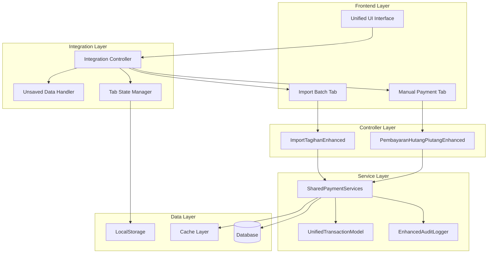

# Technical Documentation - Integrasi Pembayaran Hutang Piutang

## Table of Contents
1. [Architecture Overview](#architecture-overview)
2. [Integration Components](#integration-components)
3. [Shared Services API](#shared-services-api)
4. [Data Models and Schema](#data-models-and-schema)
5. [Migration Procedures](#migration-procedures)
6. [Deployment Guide](#deployment-guide)
7. [Performance Optimization](#performance-optimization)
8. [Security Implementation](#security-implementation)
9. [Testing Framework](#testing-framework)
10. [Monitoring and Logging](#monitoring-and-logging)

## Architecture Overview

### System Architecture Diagram



### Integration Principles

1. **Unified Interface**: Single entry point for both payment modes
2. **Shared Services**: Common business logic for consistency
3. **State Management**: Preserve user data across tab switches
4. **Data Consistency**: Unified transaction model and audit trail
5. **Performance**: Lazy loading and optimized queries
6. **Security**: Role-based access control and audit logging

### Technology Stack

- **Frontend**: Vanilla JavaScript ES6+, HTML5, CSS3
- **Backend**: Node.js with Express (if applicable)
- **Database**: SQLite/PostgreSQL with localStorage fallback
- **Storage**: Browser localStorage for client-side state
- **Testing**: Jest for unit tests, custom integration tests
- **Build**: No build process (vanilla JS)

## Integration Components

### 1. Main Integration Controller

**File**: `js/pembayaranHutangPiutangIntegrated.js`

```javascript
class PembayaranHutangPiutangIntegrated {
    constructor() {
        this.activeTab = 'manual';
        this.tabStates = new Map();
        this.sharedServices = new SharedPaymentServices();
        this.unsavedDataHandler = new UnsavedDataHandler();
        
        this.initializeComponents();
        this.setupEventListeners();
    }
    
    // Core Methods
    initializeComponents()     // Initialize all sub-components
    setupEventListeners()      // Setup UI event handlers
    switchTab(tabName)         // Handle tab switching with validation
    saveTabState(tabName)      // Save current tab state
    restoreTabState(tabName)   // Restore saved tab state
    render()                   // Render complete interface
    
    // State Management
    hasUnsavedData()          // Check for unsaved changes
    showUnsavedDataDialog()   // Show confirmation dialog
    handleUnsavedData()       // Handle user choice on unsaved data
    
    // Integration Methods
    onTransactionComplete()   // Handle transaction completion
    updateUnifiedHistory()    // Update transaction history
    refreshDashboard()        // Refresh dashboard statistics
}
```

### 2. Shared Payment Services

**File**: `js/shared/SharedPaymentServices.js`

```javascript
class SharedPaymentServices {
    constructor() {
        this.auditLogger = new EnhancedAuditLogger();
        this.transactionModel = new UnifiedTransactionModel();
        this.validator = new DataConsistencyValidator();
    }
    
    // Payment Processing
    async processPayment(paymentData, mode)
    async processBatchPayments(batchData, mode)
    
    // Journal Management
    async createJurnalEntry(transactionData)
    async updateJurnalEntry(jurnalId, updates)
    async reverseJurnalEntry(jurnalId)
    
    // Saldo Management
    async updateSaldoHutang(anggotaId, amount, operation)
    async updateSaldoPiutang(anggotaId, amount, operation)
    async getSaldoSummary(anggotaId)
    
    // Validation
    async validatePaymentAmount(amount, saldo, jenis)
    async validateAnggotaExists(anggotaId)
    async validateSaldoConsistency()
    
    // Transaction History
    async getUnifiedTransactionHistory(filters)
    async exportTransactionHistory(filters, format)
    
    // Audit and Logging
    async logTransaction(transactionData, mode)
    async logError(error, context, mode)
    async getAuditTrail(filters)
}
```

### 3. Enhanced Controllers

**Manual Payment Controller**: `js/pembayaranHutangPiutangEnhanced.js`
```javascript
class PembayaranHutangPiutangEnhanced extends PembayaranHutangPiutang {
    constructor(sharedServices, integrationCallbacks) {
        super();
        this.sharedServices = sharedServices;
        this.callbacks = integrationCallbacks;
    }
    
    // Override parent methods to use shared services
    async prosesPembayaran(data) {
        const result = await this.sharedServices.processPayment(data, 'manual');
        this.callbacks.onTransactionComplete(result);
        return result;
    }
}
```

**Import Controller**: `js/import-tagihan/ImportTagihanEnhanced.js`
```javascript
class ImportTagihanEnhanced extends ImportTagihanManager {
    constructor(sharedServices, integrationCallbacks) {
        super();
        this.sharedServices = sharedServices;
        this.callbacks = integrationCallbacks;
    }
    
    // Override to use shared services
    async processBatch(batchData) {
        const result = await this.sharedServices.processBatchPayments(batchData, 'import');
        this.callbacks.onBatchComplete(result);
        return result;
    }
}
```

## Shared Services API

### Payment Processing API

#### Process Single Payment
```javascript
/**
 * Process a single payment transaction
 * @param {Object} paymentData - Payment details
 * @param {string} mode - 'manual' or 'import'
 * @returns {Promise<Object>} Transaction result
 */
async processPayment(paymentData, mode) {
    // Input validation
    await this.validatePaymentAmount(paymentData.jumlah, paymentData.saldo, paymentData.jenis);
    
    // Create transaction
    const transaction = await this.transactionModel.create({
        ...paymentData,
        mode: mode,
        timestamp: new Date(),
        status: 'pending'
    });
    
    try {
        // Update saldo
        if (paymentData.jenis === 'hutang') {
            await this.updateSaldoHutang(paymentData.anggotaId, paymentData.jumlah, 'subtract');
        } else {
            await this.updateSaldoPiutang(paymentData.anggotaId, paymentData.jumlah, 'subtract');
        }
        
        // Create journal entry
        const jurnalEntry = await this.createJurnalEntry(transaction);
        
        // Update transaction status
        transaction.status = 'success';
        transaction.jurnalId = jurnalEntry.id;
        await this.transactionModel.update(transaction.id, transaction);
        
        // Log audit trail
        await this.auditLogger.logTransaction(transaction, mode);
        
        return { success: true, transaction, jurnalEntry };
        
    } catch (error) {
        // Rollback on error
        transaction.status = 'failed';
        transaction.error = error.message;
        await this.transactionModel.update(transaction.id, transaction);
        
        await this.auditLogger.logError(error, { transactionId: transaction.id }, mode);
        throw error;
    }
}
```

#### Process Batch Payments
```javascript
/**
 * Process multiple payments in batch
 * @param {Array} batchData - Array of payment data
 * @param {string} mode - 'import'
 * @returns {Promise<Object>} Batch result
 */
async processBatchPayments(batchData, mode) {
    const batchId = `BATCH_${Date.now()}`;
    const results = {
        batchId,
        total: batchData.length,
        successful: 0,
        failed: 0,
        transactions: [],
        errors: []
    };
    
    // Process each payment
    for (const paymentData of batchData) {
        try {
            const result = await this.processPayment({
                ...paymentData,
                batchId
            }, mode);
            
            results.successful++;
            results.transactions.push(result.transaction);
            
        } catch (error) {
            results.failed++;
            results.errors.push({
                paymentData,
                error: error.message
            });
        }
    }
    
    // Log batch completion
    await this.auditLogger.logBatchCompletion(results, mode);
    
    return results;
}
```

### Saldo Management API

#### Update Saldo Hutang
```javascript
/**
 * Update anggota's hutang balance
 * @param {string} anggotaId - Member ID
 * @param {number} amount - Amount to add/subtract
 * @param {string} operation - 'add' or 'subtract'
 * @returns {Promise<Object>} Updated saldo info
 */
async updateSaldoHutang(anggotaId, amount, operation) {
    const currentSaldo = await this.getSaldoHutang(anggotaId);
    
    let newSaldo;
    if (operation === 'add') {
        newSaldo = currentSaldo + amount;
    } else if (operation === 'subtract') {
        newSaldo = currentSaldo - amount;
        if (newSaldo < 0) {
            throw new Error('Saldo hutang tidak boleh negatif');
        }
    } else {
        throw new Error('Invalid operation: must be add or subtract');
    }
    
    // Update in database
    await this.database.updateSaldoHutang(anggotaId, newSaldo);
    
    // Update cache
    this.cache.set(`saldo_hutang_${anggotaId}`, newSaldo);
    
    return {
        anggotaId,
        saldoSebelum: currentSaldo,
        saldoSesudah: newSaldo,
        perubahan: operation === 'add' ? amount : -amount
    };
}
```

### Audit Logging API

#### Log Transaction
```javascript
/**
 * Log transaction for audit trail
 * @param {Object} transaction - Transaction data
 * @param {string} mode - Payment mode
 * @returns {Promise<void>}
 */
async logTransaction(transaction, mode) {
    const auditEntry = {
        id: `AUDIT_${Date.now()}_${Math.random().toString(36).substr(2, 9)}`,
        timestamp: new Date(),
        action: 'PAYMENT_PROCESSED',
        mode: mode,
        userId: this.getCurrentUserId(),
        sessionId: this.getSessionId(),
        transactionId: transaction.id,
        anggotaId: transaction.anggotaId,
        jenis: transaction.jenis,
        jumlah: transaction.jumlah,
        saldoSebelum: transaction.saldoSebelum,
        saldoSesudah: transaction.saldoSesudah,
        ipAddress: this.getClientIP(),
        userAgent: navigator.userAgent,
        additionalData: {
            batchId: transaction.batchId,
            keterangan: transaction.keterangan
        }
    };
    
    // Save to audit log
    await this.database.saveAuditLog(auditEntry);
    
    // Real-time notification (if enabled)
    this.notifyAuditSubscribers(auditEntry);
}
```

## Data Models and Schema

### Unified Transaction Model

```javascript
const UnifiedTransactionSchema = {
    id: {
        type: 'string',
        primary: true,
        format: 'TXN_YYYYMMDD_HHMMSS_RANDOM'
    },
    anggotaId: {
        type: 'string',
        required: true,
        references: 'anggota.id'
    },
    anggotaNama: {
        type: 'string',
        required: true
    },
    jenisPembayaran: {
        type: 'enum',
        values: ['hutang', 'piutang'],
        required: true
    },
    jumlah: {
        type: 'number',
        required: true,
        min: 0
    },
    tanggal: {
        type: 'datetime',
        required: true,
        default: 'NOW()'
    },
    kasir: {
        type: 'string',
        required: true,
        references: 'users.id'
    },
    mode: {
        type: 'enum',
        values: ['manual', 'import'],
        required: true,
        index: true
    },
    batchId: {
        type: 'string',
        nullable: true,
        index: true
    },
    keterangan: {
        type: 'text',
        nullable: true
    },
    saldoSebelum: {
        type: 'number',
        required: true
    },
    saldoSesudah: {
        type: 'number',
        required: true
    },
    jurnalId: {
        type: 'string',
        nullable: true,
        references: 'jurnal.id'
    },
    status: {
        type: 'enum',
        values: ['pending', 'success', 'failed'],
        required: true,
        default: 'pending',
        index: true
    },
    error: {
        type: 'text',
        nullable: true
    },
    createdAt: {
        type: 'datetime',
        required: true,
        default: 'NOW()'
    },
    updatedAt: {
        type: 'datetime',
        required: true,
        default: 'NOW()',
        onUpdate: 'NOW()'
    }
};
```

### Enhanced Audit Log Schema

```javascript
const EnhancedAuditLogSchema = {
    id: {
        type: 'string',
        primary: true
    },
    timestamp: {
        type: 'datetime',
        required: true,
        index: true
    },
    action: {
        type: 'string',
        required: true,
        index: true
    },
    mode: {
        type: 'enum',
        values: ['manual', 'import', 'system'],
        required: true,
        index: true
    },
    userId: {
        type: 'string',
        required: true,
        references: 'users.id',
        index: true
    },
    sessionId: {
        type: 'string',
        required: true,
        index: true
    },
    transactionId: {
        type: 'string',
        nullable: true,
        references: 'transactions.id'
    },
    anggotaId: {
        type: 'string',
        nullable: true,
        references: 'anggota.id'
    },
    jenis: {
        type: 'enum',
        values: ['hutang', 'piutang'],
        nullable: true
    },
    jumlah: {
        type: 'number',
        nullable: true
    },
    saldoSebelum: {
        type: 'number',
        nullable: true
    },
    saldoSesudah: {
        type: 'number',
        nullable: true
    },
    ipAddress: {
        type: 'string',
        nullable: true
    },
    userAgent: {
        type: 'text',
        nullable: true
    },
    additionalData: {
        type: 'json',
        nullable: true
    }
};
```

### Database Migration Scripts

#### Add Mode Field to Existing Transactions
```sql
-- Migration: Add mode field to transactions
ALTER TABLE transactions 
ADD COLUMN mode VARCHAR(10) DEFAULT 'manual' NOT NULL;

-- Create index for performance
CREATE INDEX idx_transactions_mode ON transactions(mode);

-- Update existing records
UPDATE transactions 
SET mode = 'manual' 
WHERE mode IS NULL OR mode = '';

-- Add constraint
ALTER TABLE transactions 
ADD CONSTRAINT chk_transactions_mode 
CHECK (mode IN ('manual', 'import'));
```

#### Add Batch ID Field
```sql
-- Migration: Add batchId field
ALTER TABLE transactions 
ADD COLUMN batchId VARCHAR(50) NULL;

-- Create index for batch queries
CREATE INDEX idx_transactions_batch_id ON transactions(batchId);
```

#### Create Enhanced Audit Log Table
```sql
-- Migration: Create enhanced audit log
CREATE TABLE audit_log_enhanced (
    id VARCHAR(50) PRIMARY KEY,
    timestamp DATETIME NOT NULL,
    action VARCHAR(50) NOT NULL,
    mode VARCHAR(10) NOT NULL,
    userId VARCHAR(50) NOT NULL,
    sessionId VARCHAR(100) NOT NULL,
    transactionId VARCHAR(50) NULL,
    anggotaId VARCHAR(50) NULL,
    jenis VARCHAR(10) NULL,
    jumlah DECIMAL(15,2) NULL,
    saldoSebelum DECIMAL(15,2) NULL,
    saldoSesudah DECIMAL(15,2) NULL,
    ipAddress VARCHAR(45) NULL,
    userAgent TEXT NULL,
    additionalData JSON NULL,
    
    INDEX idx_audit_timestamp (timestamp),
    INDEX idx_audit_action (action),
    INDEX idx_audit_mode (mode),
    INDEX idx_audit_user (userId),
    INDEX idx_audit_session (sessionId),
    
    FOREIGN KEY (userId) REFERENCES users(id),
    FOREIGN KEY (transactionId) REFERENCES transactions(id),
    FOREIGN KEY (anggotaId) REFERENCES anggota(id)
);
```

## Migration Procedures

### 1. Pre-Migration Checklist

```bash
# 1. Backup existing data
mysqldump -u username -p database_name > backup_pre_integration.sql

# 2. Verify current system state
node scripts/verify-system-state.js

# 3. Check dependencies
npm audit
npm list --depth=0

# 4. Test migration on staging
node scripts/run-migration.js --dry-run
```

### 2. Migration Steps

#### Step 1: Database Schema Updates
```javascript
// File: scripts/migration/001-add-mode-fields.js
const MigrationScript = {
    version: '001',
    description: 'Add mode and batchId fields to transactions',
    
    async up(db) {
        // Add mode field
        await db.query(`
            ALTER TABLE transactions 
            ADD COLUMN mode VARCHAR(10) DEFAULT 'manual' NOT NULL
        `);
        
        // Add batchId field
        await db.query(`
            ALTER TABLE transactions 
            ADD COLUMN batchId VARCHAR(50) NULL
        `);
        
        // Create indexes
        await db.query(`CREATE INDEX idx_transactions_mode ON transactions(mode)`);
        await db.query(`CREATE INDEX idx_transactions_batch_id ON transactions(batchId)`);
        
        // Update existing records
        await db.query(`UPDATE transactions SET mode = 'manual' WHERE mode = ''`);
    },
    
    async down(db) {
        await db.query(`DROP INDEX idx_transactions_batch_id`);
        await db.query(`DROP INDEX idx_transactions_mode`);
        await db.query(`ALTER TABLE transactions DROP COLUMN batchId`);
        await db.query(`ALTER TABLE transactions DROP COLUMN mode`);
    }
};
```

#### Step 2: Deploy New JavaScript Files
```bash
# Copy new integration files
cp js/pembayaranHutangPiutangIntegrated.js /var/www/html/js/
cp js/shared/*.js /var/www/html/js/shared/
cp js/import-tagihan/ImportTagihanEnhanced.js /var/www/html/js/import-tagihan/

# Update main HTML file
cp index.html /var/www/html/

# Set proper permissions
chmod 644 /var/www/html/js/*.js
chmod 644 /var/www/html/js/shared/*.js
```

#### Step 3: Update Configuration
```javascript
// File: config/integration-config.js
const IntegrationConfig = {
    // Tab permissions
    tabPermissions: {
        manual: ['kasir', 'admin'],
        import: ['admin'] // Restrict import to admin only
    },
    
    // Performance settings
    performance: {
        lazyLoadImport: true,
        cacheTimeout: 300000, // 5 minutes
        maxBatchSize: 1000
    },
    
    // Audit settings
    audit: {
        logAllTransactions: true,
        logTabSwitches: true,
        logPermissionDenials: true
    },
    
    // UI settings
    ui: {
        defaultTab: 'manual',
        rememberLastTab: true,
        unsavedDataWarning: true
    }
};
```

### 3. Post-Migration Verification

```javascript
// File: scripts/verify-integration.js
class IntegrationVerifier {
    async verifyDatabaseSchema() {
        // Check if new columns exist
        const columns = await this.db.query(`
            SHOW COLUMNS FROM transactions 
            WHERE Field IN ('mode', 'batchId')
        `);
        
        if (columns.length !== 2) {
            throw new Error('Migration incomplete: missing columns');
        }
    }
    
    async verifyDataIntegrity() {
        // Check if existing transactions have mode set
        const unmigrated = await this.db.query(`
            SELECT COUNT(*) as count 
            FROM transactions 
            WHERE mode IS NULL OR mode = ''
        `);
        
        if (unmigrated[0].count > 0) {
            throw new Error('Data migration incomplete');
        }
    }
    
    async verifyFunctionality() {
        // Test manual payment
        const manualResult = await this.testManualPayment();
        
        // Test import batch
        const importResult = await this.testImportBatch();
        
        // Test tab switching
        const tabResult = await this.testTabSwitching();
        
        return {
            manual: manualResult,
            import: importResult,
            tabSwitching: tabResult
        };
    }
}
```

### 4. Rollback Procedures

```javascript
// File: scripts/rollback-integration.js
class IntegrationRollback {
    async rollbackDatabase() {
        // Remove new columns
        await this.db.query(`ALTER TABLE transactions DROP COLUMN batchId`);
        await this.db.query(`ALTER TABLE transactions DROP COLUMN mode`);
        
        // Drop new audit table
        await this.db.query(`DROP TABLE IF EXISTS audit_log_enhanced`);
    }
    
    async rollbackFiles() {
        // Restore original files from backup
        const backupFiles = [
            'index.html',
            'js/pembayaranHutangPiutang.js',
            'js/import-tagihan/ImportTagihanManager.js'
        ];
        
        for (const file of backupFiles) {
            await this.restoreFromBackup(file);
        }
    }
    
    async rollbackConfiguration() {
        // Restore original configuration
        await this.restoreConfig('config/app-config.js');
        
        // Clear integration-specific cache
        await this.clearCache('integration_*');
    }
}
```

## Deployment Guide

### 1. Environment Setup

#### Development Environment
```bash
# Clone repository
git clone https://github.com/koperasi/aplikasi-koperasi.git
cd aplikasi-koperasi

# Install dependencies (if any)
npm install

# Setup database
mysql -u root -p < database-setup.sql

# Run migration
node scripts/run-migration.js

# Start development server
python -m http.server 8000
# or
php -S localhost:8000
```

#### Production Environment
```bash
# Backup current system
mysqldump -u username -p koperasi_db > backup_$(date +%Y%m%d_%H%M%S).sql
tar -czf files_backup_$(date +%Y%m%d_%H%M%S).tar.gz /var/www/html/

# Deploy new files
rsync -av --exclude='.git' ./ /var/www/html/

# Run migration
node scripts/run-migration.js --production

# Restart web server
sudo systemctl restart apache2
# or
sudo systemctl restart nginx
```

### 2. Configuration Files

#### Apache Virtual Host
```apache
<VirtualHost *:80>
    ServerName koperasi.local
    DocumentRoot /var/www/html
    
    # Enable mod_rewrite for SPA routing
    RewriteEngine On
    RewriteCond %{REQUEST_FILENAME} !-f
    RewriteCond %{REQUEST_FILENAME} !-d
    RewriteRule ^(.*)$ /index.html [QSA,L]
    
    # Security headers
    Header always set X-Content-Type-Options nosniff
    Header always set X-Frame-Options DENY
    Header always set X-XSS-Protection "1; mode=block"
    
    # Cache static assets
    <LocationMatch "\.(css|js|png|jpg|jpeg|gif|ico|svg)$">
        ExpiresActive On
        ExpiresDefault "access plus 1 month"
    </LocationMatch>
    
    ErrorLog ${APACHE_LOG_DIR}/koperasi_error.log
    CustomLog ${APACHE_LOG_DIR}/koperasi_access.log combined
</VirtualHost>
```

#### Nginx Configuration
```nginx
server {
    listen 80;
    server_name koperasi.local;
    root /var/www/html;
    index index.html;
    
    # SPA routing
    location / {
        try_files $uri $uri/ /index.html;
    }
    
    # API endpoints (if applicable)
    location /api/ {
        proxy_pass http://localhost:3000;
        proxy_set_header Host $host;
        proxy_set_header X-Real-IP $remote_addr;
    }
    
    # Static assets caching
    location ~* \.(css|js|png|jpg|jpeg|gif|ico|svg)$ {
        expires 1M;
        add_header Cache-Control "public, immutable";
    }
    
    # Security headers
    add_header X-Content-Type-Options nosniff;
    add_header X-Frame-Options DENY;
    add_header X-XSS-Protection "1; mode=block";
    
    # Logging
    access_log /var/log/nginx/koperasi_access.log;
    error_log /var/log/nginx/koperasi_error.log;
}
```

### 3. Database Configuration

#### MySQL Configuration
```sql
-- Create database user for application
CREATE USER 'koperasi_app'@'localhost' IDENTIFIED BY 'secure_password';
GRANT SELECT, INSERT, UPDATE, DELETE ON koperasi_db.* TO 'koperasi_app'@'localhost';
FLUSH PRIVILEGES;

-- Optimize for integration workload
SET GLOBAL innodb_buffer_pool_size = 256M;
SET GLOBAL max_connections = 100;
SET GLOBAL query_cache_size = 64M;
```

#### Connection Configuration
```javascript
// File: config/database.js
const DatabaseConfig = {
    production: {
        host: 'localhost',
        user: 'koperasi_app',
        password: process.env.DB_PASSWORD,
        database: 'koperasi_db',
        connectionLimit: 10,
        acquireTimeout: 60000,
        timeout: 60000
    },
    
    development: {
        host: 'localhost',
        user: 'root',
        password: 'password',
        database: 'koperasi_dev',
        connectionLimit: 5
    }
};
```

## Performance Optimization

### 1. Database Optimization

#### Indexing Strategy
```sql
-- Primary indexes for integration
CREATE INDEX idx_transactions_mode_date ON transactions(mode, tanggal);
CREATE INDEX idx_transactions_anggota_mode ON transactions(anggotaId, mode);
CREATE INDEX idx_transactions_batch_status ON transactions(batchId, status);

-- Composite indexes for common queries
CREATE INDEX idx_audit_user_action_date ON audit_log_enhanced(userId, action, timestamp);
CREATE INDEX idx_audit_mode_date ON audit_log_enhanced(mode, timestamp);

-- Analyze table statistics
ANALYZE TABLE transactions;
ANALYZE TABLE audit_log_enhanced;
```

#### Query Optimization
```javascript
// Optimized unified transaction history query
const getUnifiedTransactionHistory = async (filters) => {
    const { mode, dateFrom, dateTo, anggotaId, limit = 50, offset = 0 } = filters;
    
    let whereClause = 'WHERE 1=1';
    const params = [];
    
    if (mode && mode !== 'all') {
        whereClause += ' AND mode = ?';
        params.push(mode);
    }
    
    if (dateFrom) {
        whereClause += ' AND tanggal >= ?';
        params.push(dateFrom);
    }
    
    if (dateTo) {
        whereClause += ' AND tanggal <= ?';
        params.push(dateTo);
    }
    
    if (anggotaId) {
        whereClause += ' AND anggotaId = ?';
        params.push(anggotaId);
    }
    
    const query = `
        SELECT 
            id, anggotaId, anggotaNama, jenisPembayaran, 
            jumlah, tanggal, kasir, mode, batchId, 
            keterangan, status
        FROM transactions 
        ${whereClause}
        ORDER BY tanggal DESC, id DESC
        LIMIT ? OFFSET ?
    `;
    
    params.push(limit, offset);
    
    return await this.db.query(query, params);
};
```

### 2. Frontend Optimization

#### Lazy Loading Implementation
```javascript
// File: js/shared/LazyLoadingManager.js
class LazyLoadingManager {
    constructor() {
        this.loadedModules = new Set();
        this.loadingPromises = new Map();
    }
    
    async loadImportModule() {
        if (this.loadedModules.has('import')) {
            return window.ImportTagihanEnhanced;
        }
        
        if (this.loadingPromises.has('import')) {
            return await this.loadingPromises.get('import');
        }
        
        const loadPromise = this.loadScript('js/import-tagihan/ImportTagihanEnhanced.js')
            .then(() => {
                this.loadedModules.add('import');
                return window.ImportTagihanEnhanced;
            });
        
        this.loadingPromises.set('import', loadPromise);
        return await loadPromise;
    }
    
    loadScript(src) {
        return new Promise((resolve, reject) => {
            const script = document.createElement('script');
            script.src = src;
            script.onload = resolve;
            script.onerror = reject;
            document.head.appendChild(script);
        });
    }
}
```

#### Caching Strategy
```javascript
// File: js/shared/CacheManager.js
class CacheManager {
    constructor() {
        this.cache = new Map();
        this.cacheTimeout = 5 * 60 * 1000; // 5 minutes
    }
    
    set(key, value, timeout = this.cacheTimeout) {
        const expiry = Date.now() + timeout;
        this.cache.set(key, { value, expiry });
    }
    
    get(key) {
        const item = this.cache.get(key);
        if (!item) return null;
        
        if (Date.now() > item.expiry) {
            this.cache.delete(key);
            return null;
        }
        
        return item.value;
    }
    
    // Cache anggota data for autocomplete
    cacheAnggotaData(anggotaList) {
        this.set('anggota_list', anggotaList, 10 * 60 * 1000); // 10 minutes
    }
    
    getCachedAnggotaData() {
        return this.get('anggota_list');
    }
}
```

### 3. Memory Management

#### State Management Optimization
```javascript
// File: js/shared/StateManager.js
class StateManager {
    constructor() {
        this.states = new Map();
        this.maxStates = 10; // Limit memory usage
    }
    
    saveState(tabName, state) {
        // Implement LRU eviction
        if (this.states.size >= this.maxStates) {
            const firstKey = this.states.keys().next().value;
            this.states.delete(firstKey);
        }
        
        // Deep clone to prevent memory leaks
        const clonedState = JSON.parse(JSON.stringify(state));
        this.states.set(tabName, {
            state: clonedState,
            timestamp: Date.now()
        });
    }
    
    getState(tabName) {
        const item = this.states.get(tabName);
        if (!item) return null;
        
        // Expire old states (1 hour)
        if (Date.now() - item.timestamp > 60 * 60 * 1000) {
            this.states.delete(tabName);
            return null;
        }
        
        return item.state;
    }
}
```

## Security Implementation

### 1. Authentication and Authorization

#### Role-Based Access Control
```javascript
// File: js/shared/TabPermissionManager.js
class TabPermissionManager {
    constructor() {
        this.permissions = {
            manual: ['kasir', 'admin', 'supervisor'],
            import: ['admin', 'supervisor'] // More restrictive
        };
    }
    
    canAccessTab(tabName, userRole) {
        const allowedRoles = this.permissions[tabName];
        return allowedRoles && allowedRoles.includes(userRole);
    }
    
    validateTabAccess(tabName) {
        const currentUser = this.getCurrentUser();
        
        if (!currentUser) {
            throw new Error('User not authenticated');
        }
        
        if (!this.canAccessTab(tabName, currentUser.role)) {
            this.logAccessDenial(tabName, currentUser);
            throw new Error(`Access denied to ${tabName} tab`);
        }
        
        return true;
    }
    
    logAccessDenial(tabName, user) {
        const auditEntry = {
            action: 'ACCESS_DENIED',
            tabName,
            userId: user.id,
            userRole: user.role,
            timestamp: new Date(),
            ipAddress: this.getClientIP()
        };
        
        this.auditLogger.log(auditEntry);
    }
}
```

### 2. Input Validation and Sanitization

#### Payment Data Validation
```javascript
// File: js/shared/PaymentValidator.js
class PaymentValidator {
    validatePaymentData(data) {
        const errors = [];
        
        // Validate anggota ID
        if (!data.anggotaId || typeof data.anggotaId !== 'string') {
            errors.push('Invalid anggota ID');
        }
        
        // Validate amount
        if (!data.jumlah || typeof data.jumlah !== 'number' || data.jumlah <= 0) {
            errors.push('Invalid payment amount');
        }
        
        // Validate payment type
        if (!['hutang', 'piutang'].includes(data.jenisPembayaran)) {
            errors.push('Invalid payment type');
        }
        
        // Sanitize keterangan
        if (data.keterangan) {
            data.keterangan = this.sanitizeString(data.keterangan);
        }
        
        if (errors.length > 0) {
            throw new ValidationError('Payment data validation failed', errors);
        }
        
        return data;
    }
    
    sanitizeString(input) {
        return input
            .replace(/<script\b[^<]*(?:(?!<\/script>)<[^<]*)*<\/script>/gi, '') // Remove scripts
            .replace(/[<>]/g, '') // Remove HTML tags
            .trim()
            .substring(0, 255); // Limit length
    }
}
```

### 3. Audit Trail Security

#### Enhanced Security Logging
```javascript
// File: js/shared/SecurityAuditLogger.js
class SecurityAuditLogger extends EnhancedAuditLogger {
    async logSecurityEvent(event, severity = 'INFO') {
        const securityEntry = {
            ...await this.createBaseAuditEntry(),
            eventType: 'SECURITY',
            severity,
            event,
            securityContext: {
                sessionId: this.getSessionId(),
                ipAddress: this.getClientIP(),
                userAgent: navigator.userAgent,
                timestamp: new Date().toISOString(),
                csrfToken: this.getCSRFToken()
            }
        };
        
        // Log to security-specific table
        await this.database.saveSecurityLog(securityEntry);
        
        // Alert on high severity events
        if (severity === 'HIGH' || severity === 'CRITICAL') {
            await this.sendSecurityAlert(securityEntry);
        }
    }
    
    async logFailedLogin(username, reason) {
        await this.logSecurityEvent({
            action: 'LOGIN_FAILED',
            username,
            reason,
            attempts: await this.getFailedLoginCount(username)
        }, 'MEDIUM');
    }
    
    async logPermissionViolation(userId, attemptedAction, resource) {
        await this.logSecurityEvent({
            action: 'PERMISSION_VIOLATION',
            userId,
            attemptedAction,
            resource
        }, 'HIGH');
    }
}
```

## Testing Framework

### 1. Unit Testing Setup

#### Jest Configuration
```javascript
// File: jest.config.js
module.exports = {
    testEnvironment: 'jsdom',
    setupFilesAfterEnv: ['<rootDir>/jest.setup.js'],
    testMatch: [
        '**/__tests__/**/*.test.js',
        '**/?(*.)+(spec|test).js'
    ],
    collectCoverageFrom: [
        'js/**/*.js',
        '!js/**/*.test.js',
        '!js/vendor/**'
    ],
    coverageThreshold: {
        global: {
            branches: 80,
            functions: 80,
            lines: 80,
            statements: 80
        }
    }
};
```

#### Test Utilities
```javascript
// File: __tests__/utils/testUtils.js
class TestUtils {
    static createMockUser(role = 'kasir') {
        return {
            id: 'user_' + Math.random().toString(36).substr(2, 9),
            username: 'test_user',
            role,
            nama: 'Test User'
        };
    }
    
    static createMockTransaction(overrides = {}) {
        return {
            id: 'txn_' + Date.now(),
            anggotaId: 'A001',
            anggotaNama: 'Test Anggota',
            jenisPembayaran: 'hutang',
            jumlah: 100000,
            tanggal: new Date(),
            kasir: 'test_kasir',
            mode: 'manual',
            status: 'success',
            ...overrides
        };
    }
    
    static async waitFor(condition, timeout = 5000) {
        const start = Date.now();
        while (Date.now() - start < timeout) {
            if (await condition()) {
                return true;
            }
            await new Promise(resolve => setTimeout(resolve, 100));
        }
        throw new Error('Condition not met within timeout');
    }
}
```

### 2. Integration Testing

#### End-to-End Test Example
```javascript
// File: __tests__/integration/paymentFlow.test.js
describe('Payment Flow Integration', () => {
    let integrationController;
    let mockDatabase;
    
    beforeEach(() => {
        mockDatabase = new MockDatabase();
        integrationController = new PembayaranHutangPiutangIntegrated();
        integrationController.sharedServices.database = mockDatabase;
    });
    
    test('should process manual payment and update unified history', async () => {
        // Setup
        const paymentData = TestUtils.createMockTransaction();
        const user = TestUtils.createMockUser('kasir');
        
        // Mock user session
        integrationController.setCurrentUser(user);
        
        // Process payment
        const result = await integrationController.processManualPayment(paymentData);
        
        // Verify transaction created
        expect(result.success).toBe(true);
        expect(result.transaction.mode).toBe('manual');
        
        // Verify unified history updated
        const history = await integrationController.getUnifiedHistory();
        expect(history).toContainEqual(
            expect.objectContaining({
                id: result.transaction.id,
                mode: 'manual'
            })
        );
        
        // Verify audit log
        const auditLogs = await mockDatabase.getAuditLogs();
        expect(auditLogs).toContainEqual(
            expect.objectContaining({
                action: 'PAYMENT_PROCESSED',
                mode: 'manual',
                transactionId: result.transaction.id
            })
        );
    });
    
    test('should handle tab switching with unsaved data', async () => {
        // Setup unsaved data in manual tab
        integrationController.setTabData('manual', {
            anggotaId: 'A001',
            jumlah: 50000,
            unsaved: true
        });
        
        // Mock user confirmation
        const mockConfirm = jest.fn().mockResolvedValue('save');
        integrationController.unsavedDataHandler.showConfirmDialog = mockConfirm;
        
        // Attempt tab switch
        await integrationController.switchTab('import');
        
        // Verify confirmation was shown
        expect(mockConfirm).toHaveBeenCalled();
        
        // Verify data was saved
        const savedData = integrationController.getTabData('manual');
        expect(savedData.unsaved).toBe(false);
        
        // Verify tab switched
        expect(integrationController.activeTab).toBe('import');
    });
});
```

### 3. Property-Based Testing

#### Transaction Properties
```javascript
// File: __tests__/properties/transactionProperties.test.js
const fc = require('fast-check');

describe('Transaction Properties', () => {
    test('saldo calculations should always be consistent', () => {
        fc.assert(fc.property(
            fc.record({
                saldoAwal: fc.integer(0, 10000000),
                pembayaran: fc.integer(1, 1000000),
                jenis: fc.constantFrom('hutang', 'piutang')
            }),
            (data) => {
                const { saldoAwal, pembayaran, jenis } = data;
                
                // Skip invalid cases
                if (jenis === 'hutang' && pembayaran > saldoAwal) {
                    return true; // Should be rejected by validation
                }
                
                const calculator = new SaldoCalculator();
                const result = calculator.calculateNewSaldo(saldoAwal, pembayaran, jenis);
                
                if (jenis === 'hutang') {
                    expect(result).toBe(saldoAwal - pembayaran);
                    expect(result).toBeGreaterThanOrEqual(0);
                } else {
                    expect(result).toBe(saldoAwal - pembayaran);
                }
                
                return true;
            }
        ));
    });
    
    test('audit logs should be created for all successful transactions', () => {
        fc.assert(fc.property(
            fc.record({
                anggotaId: fc.string(1, 10),
                jumlah: fc.integer(1, 1000000),
                jenis: fc.constantFrom('hutang', 'piutang'),
                mode: fc.constantFrom('manual', 'import')
            }),
            async (transactionData) => {
                const mockAuditLogger = new MockAuditLogger();
                const sharedServices = new SharedPaymentServices();
                sharedServices.auditLogger = mockAuditLogger;
                
                try {
                    await sharedServices.processPayment(transactionData, transactionData.mode);
                    
                    // Verify audit log was created
                    const auditLogs = mockAuditLogger.getLogs();
                    expect(auditLogs.length).toBeGreaterThan(0);
                    expect(auditLogs[0].mode).toBe(transactionData.mode);
                    
                } catch (error) {
                    // If transaction failed, audit log should still exist for the error
                    const auditLogs = mockAuditLogger.getLogs();
                    expect(auditLogs.some(log => log.action === 'PAYMENT_FAILED')).toBe(true);
                }
                
                return true;
            }
        ));
    });
});
```

## Monitoring and Logging

### 1. Application Monitoring

#### Performance Metrics
```javascript
// File: js/shared/PerformanceMonitor.js
class PerformanceMonitor {
    constructor() {
        this.metrics = new Map();
        this.thresholds = {
            tabSwitch: 500, // ms
            paymentProcess: 2000, // ms
            importBatch: 30000 // ms
        };
    }
    
    startTimer(operation) {
        const startTime = performance.now();
        return {
            end: () => {
                const duration = performance.now() - startTime;
                this.recordMetric(operation, duration);
                return duration;
            }
        };
    }
    
    recordMetric(operation, duration) {
        if (!this.metrics.has(operation)) {
            this.metrics.set(operation, []);
        }
        
        const operationMetrics = this.metrics.get(operation);
        operationMetrics.push({
            duration,
            timestamp: Date.now()
        });
        
        // Keep only last 100 measurements
        if (operationMetrics.length > 100) {
            operationMetrics.shift();
        }
        
        // Check threshold
        const threshold = this.thresholds[operation];
        if (threshold && duration > threshold) {
            this.reportSlowOperation(operation, duration, threshold);
        }
    }
    
    getAverageTime(operation) {
        const metrics = this.metrics.get(operation);
        if (!metrics || metrics.length === 0) return 0;
        
        const sum = metrics.reduce((acc, metric) => acc + metric.duration, 0);
        return sum / metrics.length;
    }
    
    reportSlowOperation(operation, duration, threshold) {
        console.warn(`Slow operation detected: ${operation} took ${duration}ms (threshold: ${threshold}ms)`);
        
        // Send to monitoring service
        this.sendToMonitoring({
            type: 'performance_warning',
            operation,
            duration,
            threshold,
            timestamp: Date.now()
        });
    }
}
```

### 2. Error Tracking

#### Error Reporter
```javascript
// File: js/shared/ErrorReporter.js
class ErrorReporter {
    constructor() {
        this.errorQueue = [];
        this.maxQueueSize = 50;
        
        // Setup global error handlers
        window.addEventListener('error', this.handleGlobalError.bind(this));
        window.addEventListener('unhandledrejection', this.handleUnhandledRejection.bind(this));
    }
    
    reportError(error, context = {}) {
        const errorReport = {
            id: this.generateErrorId(),
            timestamp: new Date().toISOString(),
            message: error.message,
            stack: error.stack,
            context: {
                ...context,
                url: window.location.href,
                userAgent: navigator.userAgent,
                userId: this.getCurrentUserId(),
                sessionId: this.getSessionId()
            }
        };
        
        // Add to queue
        this.errorQueue.push(errorReport);
        if (this.errorQueue.length > this.maxQueueSize) {
            this.errorQueue.shift();
        }
        
        // Send immediately for critical errors
        if (this.isCriticalError(error)) {
            this.sendErrorReport(errorReport);
        }
        
        // Log to console in development
        if (this.isDevelopment()) {
            console.error('Error reported:', errorReport);
        }
    }
    
    handleGlobalError(event) {
        this.reportError(new Error(event.message), {
            type: 'global_error',
            filename: event.filename,
            lineno: event.lineno,
            colno: event.colno
        });
    }
    
    handleUnhandledRejection(event) {
        this.reportError(new Error(event.reason), {
            type: 'unhandled_promise_rejection'
        });
    }
    
    isCriticalError(error) {
        const criticalPatterns = [
            /database.*connection/i,
            /authentication.*failed/i,
            /permission.*denied/i,
            /transaction.*failed/i
        ];
        
        return criticalPatterns.some(pattern => pattern.test(error.message));
    }
    
    async sendErrorReport(errorReport) {
        try {
            await fetch('/api/errors', {
                method: 'POST',
                headers: {
                    'Content-Type': 'application/json'
                },
                body: JSON.stringify(errorReport)
            });
        } catch (sendError) {
            console.error('Failed to send error report:', sendError);
        }
    }
}
```

### 3. Usage Analytics

#### Analytics Tracker
```javascript
// File: js/shared/AnalyticsTracker.js
class AnalyticsTracker {
    constructor() {
        this.events = [];
        this.sessionStart = Date.now();
        this.pageViews = new Map();
    }
    
    trackTabSwitch(fromTab, toTab) {
        this.trackEvent('tab_switch', {
            from_tab: fromTab,
            to_tab: toTab,
            session_duration: Date.now() - this.sessionStart
        });
    }
    
    trackPaymentProcessed(mode, amount, success) {
        this.trackEvent('payment_processed', {
            mode,
            amount_range: this.getAmountRange(amount),
            success,
            processing_time: this.getLastProcessingTime()
        });
    }
    
    trackImportBatch(fileSize, recordCount, successCount, failedCount) {
        this.trackEvent('import_batch', {
            file_size_range: this.getFileSizeRange(fileSize),
            record_count_range: this.getRecordCountRange(recordCount),
            success_rate: successCount / (successCount + failedCount),
            processing_time: this.getLastProcessingTime()
        });
    }
    
    trackEvent(eventName, properties = {}) {
        const event = {
            name: eventName,
            timestamp: Date.now(),
            properties: {
                ...properties,
                user_id: this.getCurrentUserId(),
                session_id: this.getSessionId(),
                page_url: window.location.href
            }
        };
        
        this.events.push(event);
        
        // Send to analytics service
        this.sendAnalytics(event);
    }
    
    getAmountRange(amount) {
        if (amount < 100000) return 'small';
        if (amount < 1000000) return 'medium';
        if (amount < 10000000) return 'large';
        return 'very_large';
    }
    
    async sendAnalytics(event) {
        try {
            await fetch('/api/analytics', {
                method: 'POST',
                headers: {
                    'Content-Type': 'application/json'
                },
                body: JSON.stringify(event)
            });
        } catch (error) {
            console.warn('Failed to send analytics:', error);
        }
    }
}
```

---

**Document Version**: 1.0  
**Last Updated**: December 2024  
**Maintained By**: Development Team  
**Review Schedule**: Quarterly