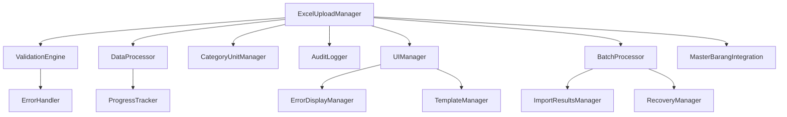

# Technical Documentation - Upload Master Barang Excel

## Table of Contents
1. [Architecture Overview](#architecture-overview)
2. [API Interfaces](#api-interfaces)
3. [Component Architecture](#component-architecture)
4. [Data Models](#data-models)
5. [Database Schema](#database-schema)
6. [Configuration](#configuration)
7. [Deployment Guide](#deployment-guide)
8. [Monitoring and Logging](#monitoring-and-logging)
9. [Performance Optimization](#performance-optimization)
10. [Security Considerations](#security-considerations)
11. [Testing Strategy](#testing-strategy)
12. [Troubleshooting](#troubleshooting)

## Architecture Overview

### System Architecture

```
┌─────────────────────────────────────────────────────────────┐
│                    Frontend Layer                           │
├─────────────────────────────────────────────────────────────┤
│  upload_master_barang_excel.html                           │
│  ├── ExcelUploadManager.js (Main Controller)               │
│  ├── ValidationEngine.js (Data Validation)                 │
│  ├── DataProcessor.js (File Processing)                    │
│  ├── CategoryUnitManager.js (Category/Unit Management)     │
│  ├── AuditLogger.js (Audit Trail)                         │
│  └── UI Components (Progress, Preview, Error Display)      │
└─────────────────────────────────────────────────────────────┘
                              │
                              ▼
┌─────────────────────────────────────────────────────────────┐
│                   Storage Layer                             │
├─────────────────────────────────────────────────────────────┤
│  localStorage (Client-side persistence)                     │
│  ├── master_barang (Main data storage)                     │
│  ├── categories (Category management)                      │
│  ├── units (Unit management)                               │
│  ├── upload_sessions (Session tracking)                    │
│  └── audit_log (Activity logging)                          │
└─────────────────────────────────────────────────────────────┘
```

### Technology Stack

- **Frontend**: Vanilla JavaScript (ES6+), HTML5, CSS3
- **UI Framework**: Bootstrap 5.3
- **File Processing**: Papa Parse (CSV), SheetJS (Excel)
- **Testing**: Jest, fast-check (Property-based testing)
- **Storage**: localStorage (client-side)
- **Build Tools**: None (vanilla implementation)

## API Interfaces

### ExcelUploadManager Class

**Primary Controller for Upload Operations**

```javascript
class ExcelUploadManager {
    constructor(options = {})
    
    // Core Methods
    async uploadFile(file)
    async validateData(data)
    async previewData(data, validationResults)
    async importData(validatedData, options = {})
    
    // Session Management
    createSession(fileName, fileSize, recordCount)
    updateSession(sessionId, updates)
    getSession(sessionId)
    
    // History and Audit
    getUploadHistory(filters = {})
    rollbackImport(sessionId)
    
    // Event Handlers
    onProgress(callback)
    onError(callback)
    onComplete(callback)
}
```

**Constructor Options:**
```javascript
const uploadManager = new ExcelUploadManager({
    maxFileSize: 5 * 1024 * 1024, // 5MB
    chunkSize: 100, // Records per chunk
    enableAudit: true,
    autoCreateCategories: true,
    autoCreateUnits: true,
    validationLevel: 'strict' // 'strict' | 'moderate' | 'lenient'
});
```

**Method Details:**

#### uploadFile(file)
```javascript
/**
 * Upload and parse file
 * @param {File} file - File object from input or drag&drop
 * @returns {Promise<Object>} Parse results with data and metadata
 */
async uploadFile(file) {
    // Returns:
    // {
    //   success: boolean,
    //   data: Array<Object>,
    //   metadata: {
    //     fileName: string,
    //     fileSize: number,
    //     recordCount: number,
    //     columns: Array<string>
    //   },
    //   errors: Array<ValidationError>
    // }
}
```

#### validateData(data)
```javascript
/**
 * Comprehensive data validation
 * @param {Array<Object>} data - Parsed data array
 * @returns {Promise<Object>} Validation results
 */
async validateData(data) {
    // Returns:
    // {
    //   isValid: boolean,
    //   errors: Array<ValidationError>,
    //   warnings: Array<ValidationWarning>,
    //   statistics: {
    //     totalRecords: number,
    //     validRecords: number,
    //     errorRecords: number,
    //     warningRecords: number
    //   },
    //   newCategories: Array<string>,
    //   newUnits: Array<string>
    // }
}
```

### ValidationEngine Class

**Data Validation and Business Rules**

```javascript
class ValidationEngine {
    constructor(rules = {})
    
    // Validation Methods
    validateFileFormat(file)
    validateFileSize(file, maxSize)
    validateHeaders(headers, requiredHeaders)
    validateRecord(record, rowIndex)
    validateBusinessRules(record, existingData)
    
    // Batch Validation
    validateBatch(records, startIndex = 0)
    
    // Rule Management
    addRule(fieldName, validator)
    removeRule(fieldName, ruleName)
    getRules(fieldName)
}
```

**Validation Rules Configuration:**
```javascript
const validationRules = {
    kode: [
        { name: 'required', message: 'Kode barang wajib diisi' },
        { name: 'maxLength', value: 20, message: 'Kode maksimal 20 karakter' },
        { name: 'unique', message: 'Kode barang harus unik' },
        { name: 'pattern', value: /^[A-Za-z0-9_-]+$/, message: 'Kode hanya boleh huruf, angka, dash, underscore' }
    ],
    nama: [
        { name: 'required', message: 'Nama barang wajib diisi' },
        { name: 'maxLength', value: 100, message: 'Nama maksimal 100 karakter' }
    ],
    harga_beli: [
        { name: 'required', message: 'Harga beli wajib diisi' },
        { name: 'numeric', message: 'Harga beli harus berupa angka' },
        { name: 'positive', message: 'Harga beli harus positif' }
    ]
};
```
### DataProcessor Class

**File Parsing and Data Transformation**

```javascript
class DataProcessor {
    constructor(options = {})
    
    // File Processing
    async parseCSV(csvContent, options = {})
    async parseExcel(excelFile, options = {})
    
    // Data Transformation
    transformRecord(rawRecord, mapping = {})
    normalizeData(data)
    
    // Chunked Processing
    createChunks(data, chunkSize = 100)
    async processChunk(chunk, processor)
}
```

**CSV Processing Options:**
```javascript
const csvOptions = {
    delimiter: ',',
    quoteChar: '"',
    escapeChar: '"',
    header: true,
    skipEmptyLines: true,
    encoding: 'UTF-8'
};
```

### CategoryUnitManager Class

**Category and Unit Management**

```javascript
class CategoryUnitManager {
    constructor(storage = localStorage)
    
    // Category Management
    getCategories()
    createCategory(name, description = '')
    updateCategory(name, updates)
    deleteCategory(name)
    validateCategoryUsage(name)
    
    // Unit Management  
    getUnits()
    createUnit(name, description = '')
    updateUnit(name, updates)
    deleteUnit(name)
    validateUnitUsage(name)
    
    // Auto-creation
    detectNewCategories(data)
    detectNewUnits(data)
    autoCreateFromData(data, options = {})
}
```

### AuditLogger Class

**Comprehensive Audit Logging**

```javascript
class AuditLogger {
    constructor(storage = localStorage)
    
    // Logging Methods
    logUploadStart(sessionId, metadata)
    logValidationResults(sessionId, results)
    logDataChanges(sessionId, changes)
    logImportComplete(sessionId, results)
    logError(sessionId, error, context)
    
    // Query Methods
    getAuditTrail(filters = {})
    getSessionLog(sessionId)
    exportAuditLog(format = 'json', filters = {})
    
    // Maintenance
    cleanupOldLogs(retentionDays = 90)
    getStorageUsage()
}
```

## Component Architecture

### File Structure

```
js/upload-excel/
├── ExcelUploadManager.js          # Main controller
├── ValidationEngine.js            # Data validation
├── DataProcessor.js               # File processing
├── CategoryUnitManager.js         # Category/Unit management
├── AuditLogger.js                 # Audit logging
├── UIManager.js                   # UI components
├── ProgressTracker.js             # Progress tracking
├── ErrorHandler.js                # Error handling
├── ErrorDisplayManager.js         # Error display
├── RecoveryManager.js             # Error recovery
├── TemplateManager.js             # Template management
├── ImportResultsManager.js        # Results display
├── BatchProcessor.js              # Batch processing
├── MasterBarangIntegration.js     # System integration
└── types.js                       # Type definitions
```

### Component Dependencies



### Module Loading Strategy

```javascript
// Dynamic module loading for better performance
class ModuleLoader {
    static async loadModule(moduleName) {
        const modules = {
            'validation': () => import('./ValidationEngine.js'),
            'processor': () => import('./DataProcessor.js'),
            'category': () => import('./CategoryUnitManager.js'),
            'audit': () => import('./AuditLogger.js')
        };
        
        if (modules[moduleName]) {
            return await modules[moduleName]();
        }
        throw new Error(`Module ${moduleName} not found`);
    }
}
```
## Data Models

### Core Data Types

```javascript
// Type definitions in types.js

/**
 * Upload Session
 */
interface UploadSession {
    id: string;
    timestamp: string; // ISO8601
    user: string;
    fileName: string;
    fileSize: number;
    recordCount: number;
    status: 'pending' | 'processing' | 'completed' | 'failed' | 'cancelled';
    validationResults: ValidationResults;
    importResults: ImportResults;
    auditLog: AuditEntry[];
    metadata: SessionMetadata;
}

/**
 * Validation Results
 */
interface ValidationResults {
    isValid: boolean;
    errors: ValidationError[];
    warnings: ValidationWarning[];
    statistics: ValidationStatistics;
    newCategories: string[];
    newUnits: string[];
}

/**
 * Validation Error
 */
interface ValidationError {
    type: 'format' | 'business' | 'integrity' | 'system';
    field: string;
    row: number;
    message: string;
    severity: 'error' | 'warning';
    code: string;
    value?: any;
    suggestion?: string;
}

/**
 * Barang Data Model
 */
interface BarangData {
    kode: string;           // Required, unique, max 20 chars
    nama: string;           // Required, max 100 chars
    kategori: string;       // Required, lowercase
    satuan: string;         // Required, lowercase
    harga_beli: number;     // Required, positive
    stok: number;           // Required, non-negative
    supplier?: string;      // Optional, max 100 chars
    created_at: string;     // ISO8601
    updated_at: string;     // ISO8601
    created_by: string;     // User ID
    updated_by: string;     // User ID
}

/**
 * Category Model
 */
interface Category {
    name: string;           // Primary key, lowercase
    display_name: string;   // Display name
    description?: string;   // Optional description
    created_at: string;     // ISO8601
    created_by: string;     // User ID
    usage_count: number;    // Number of items using this category
}

/**
 * Unit Model
 */
interface Unit {
    name: string;           // Primary key, lowercase
    display_name: string;   // Display name
    description?: string;   // Optional description
    created_at: string;     // ISO8601
    created_by: string;     // User ID
    usage_count: number;    // Number of items using this unit
}

/**
 * Audit Entry
 */
interface AuditEntry {
    id: string;
    timestamp: string;      // ISO8601
    user: string;
    action: 'upload' | 'validate' | 'import' | 'rollback' | 'error';
    details: object;
    oldData?: object;
    newData?: object;
    sessionId: string;
    context?: object;
}
```

### Data Validation Schema

```javascript
// Validation schema for runtime type checking
const ValidationSchema = {
    BarangData: {
        kode: {
            type: 'string',
            required: true,
            maxLength: 20,
            pattern: /^[A-Za-z0-9_-]+$/,
            unique: true
        },
        nama: {
            type: 'string',
            required: true,
            maxLength: 100,
            minLength: 1
        },
        kategori: {
            type: 'string',
            required: true,
            maxLength: 50,
            transform: 'lowercase',
            pattern: /^[a-z0-9_]+$/
        },
        satuan: {
            type: 'string',
            required: true,
            maxLength: 20,
            transform: 'lowercase',
            pattern: /^[a-z0-9_]+$/
        },
        harga_beli: {
            type: 'number',
            required: true,
            min: 0.01,
            precision: 2
        },
        stok: {
            type: 'number',
            required: true,
            min: 0,
            precision: 2
        },
        supplier: {
            type: 'string',
            required: false,
            maxLength: 100
        }
    }
};
```
## Database Schema

### localStorage Structure

```javascript
// Storage keys and structure
const StorageKeys = {
    MASTER_BARANG: 'koperasi_master_barang',
    CATEGORIES: 'koperasi_categories',
    UNITS: 'koperasi_units',
    UPLOAD_SESSIONS: 'koperasi_upload_sessions',
    AUDIT_LOG: 'koperasi_audit_log',
    SETTINGS: 'koperasi_upload_settings'
};

// Data structure in localStorage
localStorage.setItem('koperasi_master_barang', JSON.stringify({
    version: '1.0',
    lastUpdated: '2024-12-12T10:30:00Z',
    data: {
        'BRG001': {
            kode: 'BRG001',
            nama: 'Beras Premium 5kg',
            kategori: 'makanan',
            satuan: 'kg',
            harga_beli: 45000,
            stok: 100,
            supplier: 'PT Beras Sejahtera',
            created_at: '2024-12-12T10:30:00Z',
            updated_at: '2024-12-12T10:30:00Z',
            created_by: 'admin',
            updated_by: 'admin'
        }
        // ... more records
    },
    indexes: {
        by_kategori: {
            'makanan': ['BRG001', 'BRG002'],
            'minuman': ['BRG003']
        },
        by_supplier: {
            'PT Beras Sejahtera': ['BRG001']
        }
    }
}));
```

### Data Migration Strategy

```javascript
class DataMigration {
    static migrations = {
        '1.0': {
            description: 'Initial schema',
            migrate: (data) => data
        },
        '1.1': {
            description: 'Add audit fields',
            migrate: (data) => {
                // Add created_by and updated_by fields
                Object.values(data.data).forEach(item => {
                    item.created_by = item.created_by || 'system';
                    item.updated_by = item.updated_by || 'system';
                });
                return data;
            }
        }
    };
    
    static async migrateData(currentVersion, targetVersion) {
        // Migration logic
    }
}
```

## Configuration

### Application Configuration

```javascript
// config.js
const AppConfig = {
    // File Upload Settings
    upload: {
        maxFileSize: 5 * 1024 * 1024, // 5MB
        allowedFormats: ['.csv', '.xlsx'],
        chunkSize: 100, // Records per processing chunk
        timeout: 300000, // 5 minutes
        retryAttempts: 3
    },
    
    // Validation Settings
    validation: {
        level: 'strict', // 'strict' | 'moderate' | 'lenient'
        autoCreateCategories: true,
        autoCreateUnits: true,
        duplicateHandling: 'error', // 'error' | 'warning' | 'skip'
        emptyFieldHandling: 'error'
    },
    
    // Performance Settings
    performance: {
        enableWorkers: true,
        maxConcurrentChunks: 3,
        progressUpdateInterval: 100, // ms
        memoryThreshold: 100 * 1024 * 1024 // 100MB
    },
    
    // UI Settings
    ui: {
        theme: 'bootstrap',
        language: 'id',
        dateFormat: 'DD/MM/YYYY',
        numberFormat: 'id-ID',
        enableAnimations: true
    },
    
    // Audit Settings
    audit: {
        enabled: true,
        retentionDays: 90,
        logLevel: 'info', // 'debug' | 'info' | 'warn' | 'error'
        maxLogSize: 10 * 1024 * 1024 // 10MB
    },
    
    // Error Handling
    errorHandling: {
        enableRecovery: true,
        autoRetry: true,
        showStackTrace: false, // Only in development
        reportErrors: true
    }
};
```

### Environment Configuration

```javascript
// environment.js
const Environment = {
    development: {
        debug: true,
        logLevel: 'debug',
        enableMockData: true,
        apiTimeout: 30000
    },
    
    staging: {
        debug: false,
        logLevel: 'info',
        enableMockData: false,
        apiTimeout: 15000
    },
    
    production: {
        debug: false,
        logLevel: 'warn',
        enableMockData: false,
        apiTimeout: 10000,
        enableCompression: true,
        enableCaching: true
    }
};

// Get current environment
const currentEnv = Environment[process.env.NODE_ENV || 'development'];
```